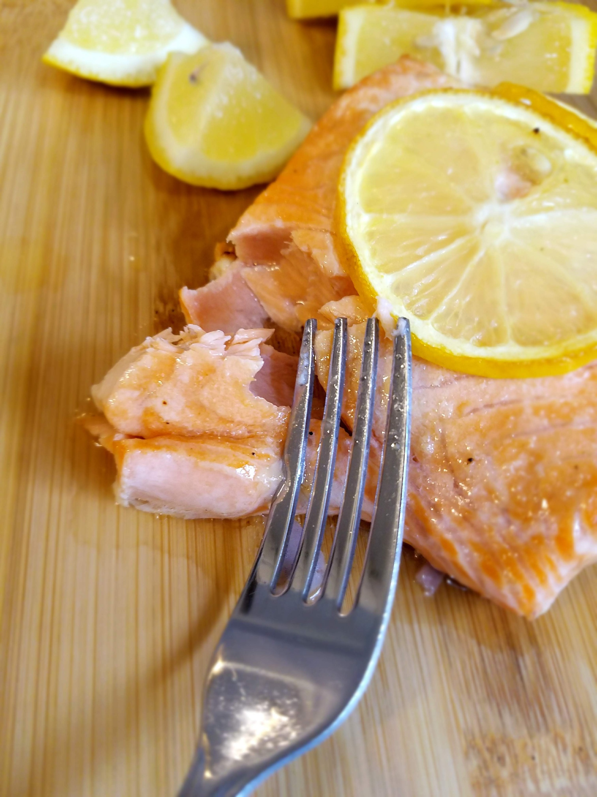
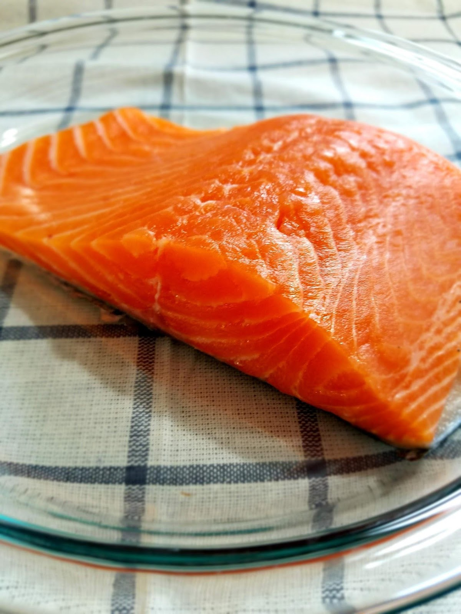
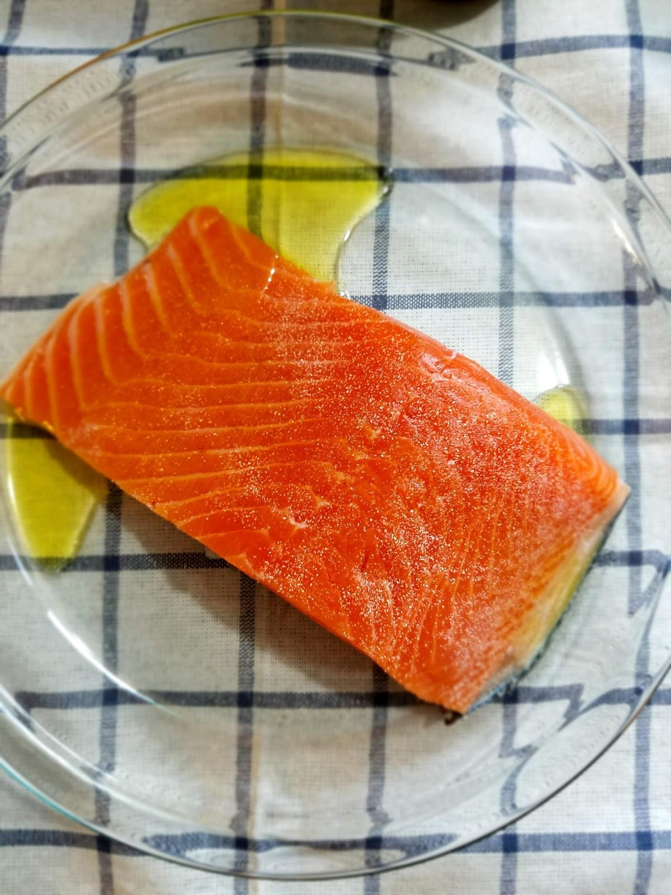
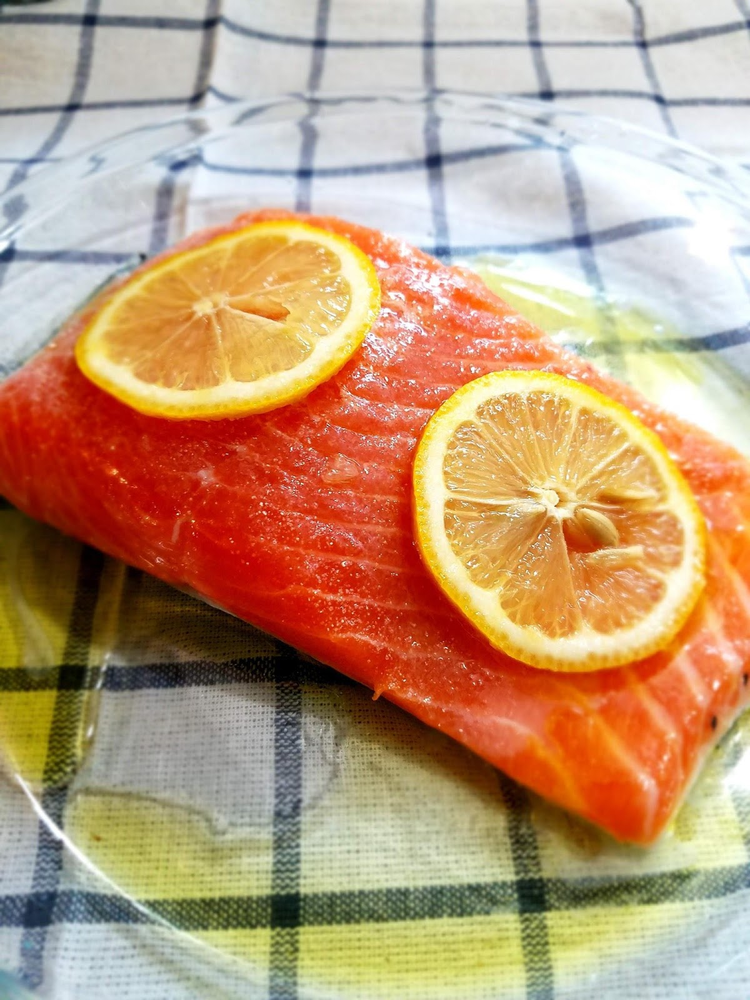
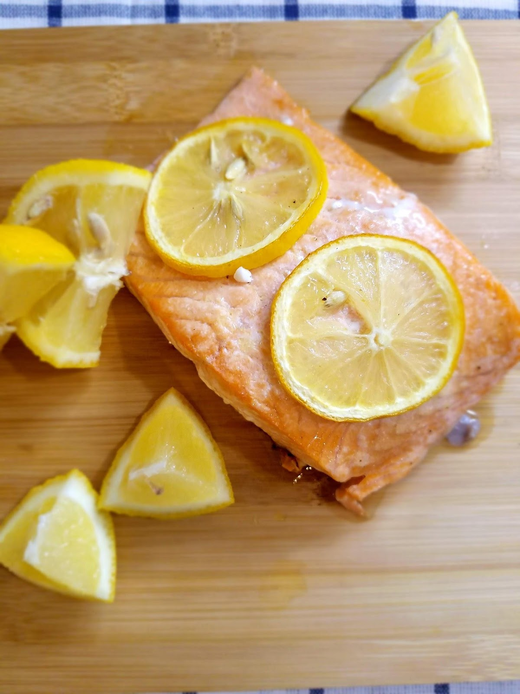
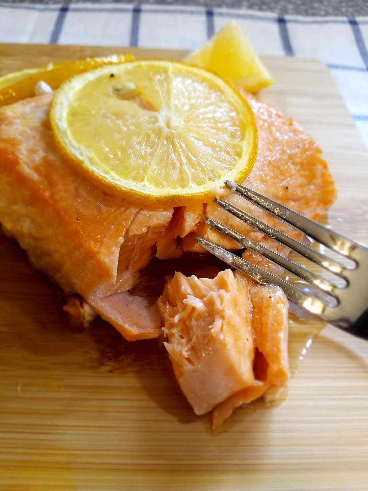

BAKED FRESH SALMON
Baked Fresh Salmon
I don’t know when exactly my love for salmon began, but I was at least 14 or 15 years old before I dared taste fish.

What was my problem? I grew up in Southern California! There was FANTASTIC fish EVERYWHERE! Why did it take me so long to try fish?

Well, apart from the occasional shrimp tacos, we were not a fish-eating family. To this day, I think there are only 4 out of the 7 of us that actually eat fish. My mom will not eat it to save her life. My dad enjoys seafood sometimes, but it is not his usual preference, and my siblings are not quite converted.

BUT! My grandpa, Poppy, is famous for his grilled salmon. Famous for all of his barbecue skills, actually, but his salmon is something special! So when I was a teenager and finally brave enough to explore new foods his salmon was the first thing on my list. I don’t know what he puts on it, but it is incredible.

From there I began ordering salmon at restaurants and getting more seafood pastas, fish tacos and shrimp dishes. Then I tried Scallops…. And my world flipped upside down!

There’s a place (under construction right now) right off the pier at Newport Beach in Southern California called The Crab Cooker where they serve the best scallops in the world. Truly, honestly, never have I had better scallops in my life! (Or better of any seafood.)

Then when I was a junior and senior in high school my best friends and I would meet at the local outdoor mall and hit up the happy hour sushi at Kabuki every Tuesday after school, and sometimes on Thursdays too. That’s where I had raw fish for the first time. It took me a few tries to get over the texture and the idea of it, but once I was converted, I was hooked! Sushi became a huge part of my social life for the next few years!

Once I was married, I tried making salmon several different ways. I was really intimidated by it at first, mostly because when fish tastes bad….. It tastes REALLY bad. We tried using thawed salmon filets from the freezer section of my grocery store (first mistake!), which were skinless (second mistake!) and I tried cooking it on the stove top, which can be good but I didn’t know what I was doing and it ended up tough and rubbery….. (Which was my third mistake) Not good. I tried to add different sauces and marinades to make it better but ultimately it failed every time.

Then one day I decided to buy fresh salmon. I braved the seafood counter at my local grocery store (which I had previously been much too intimidated to approach) and asked for a pound of the fresh Atlantic salmon. I got home, totally clueless, and called the master.

Poppy.

Luckily it was summertime and we had a little miniature camping grill, because he recommended grilling it skin side up with a little olive oil, lemon juice, and garlic salt. My husband sat on a little stool on our tiny front patio and watched that salmon filet until it matched Poppy’s descriptions exactly.

Oh. My. Word. There was never anything more delicious!

The salmon didn’t even make it to plates! We ate it off the grill with forks!

After that I think I bought a fresh salmon filet every week.

Then winter came, and grilling in 15 degree weather was just not an option. So I did a bunch of research about the best way to cook salmon indoors and baking was the winner!

Now we eat this baked fresh salmon at least twice a month. My kids scarf it down like it’s going extinct, and my husband and I never leave any leftovers. It’s so fresh, simple, delicious, and as healthy as you can get!

It’s so easy.

Start with a filet of fresh salmon, skin on. It doesn’t matter how much, it can be half a pound or even three pounds or more. The instructions are the same.

Rinse your salmon and pat dry with paper towels. Line a baking dish with foil (for easy cleanup) and spray it with olive oil. Set the salmon filet on the oiled foil skin side down. (it looked prettier without the foil for the pictures, but otherwise I use foil.)

Then drizzle it with olive oil and sprinkle it with the desired amount of garlic salt.

Then squeeze some lemon juice over it and top it with a few fresh lemon slices.

Bake at 425F for 25 minutes, until the fish flakes easily with a fork in the thickest places. 25-30 minutes is almost always perfect, no matter how much I’m cooking. The thickness of salmon doesn’t vary all that much so neither does the cooking time!

Then serve with fresh lemon slices and your favorite sides. We love pairing this with some red potatoes, quartered and baked in seasonings, or a flavored yellow rice along with any kind of vegetable you like. We like steamed broccoli, salads, asparagus, green beans, etc.

Enjoy!
