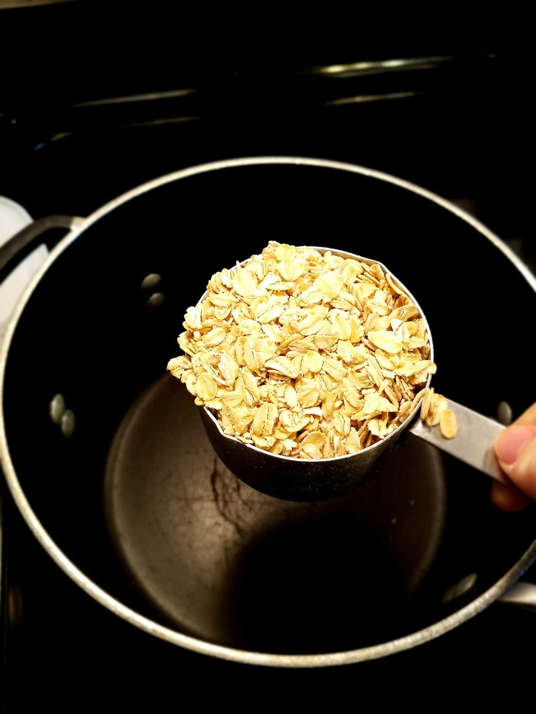
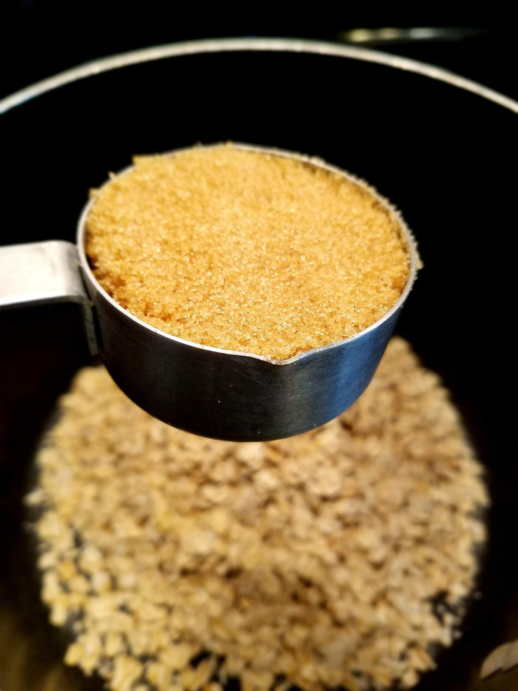
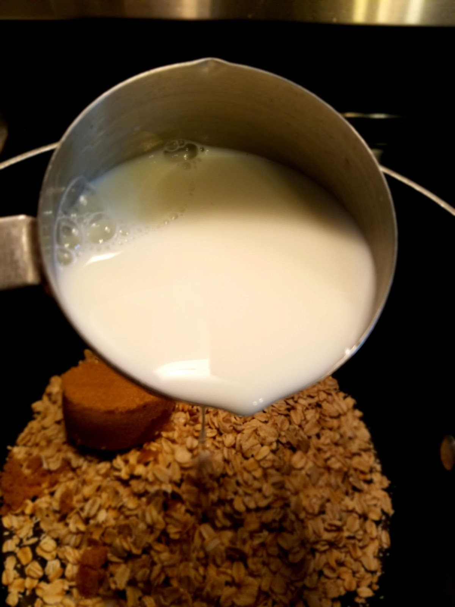
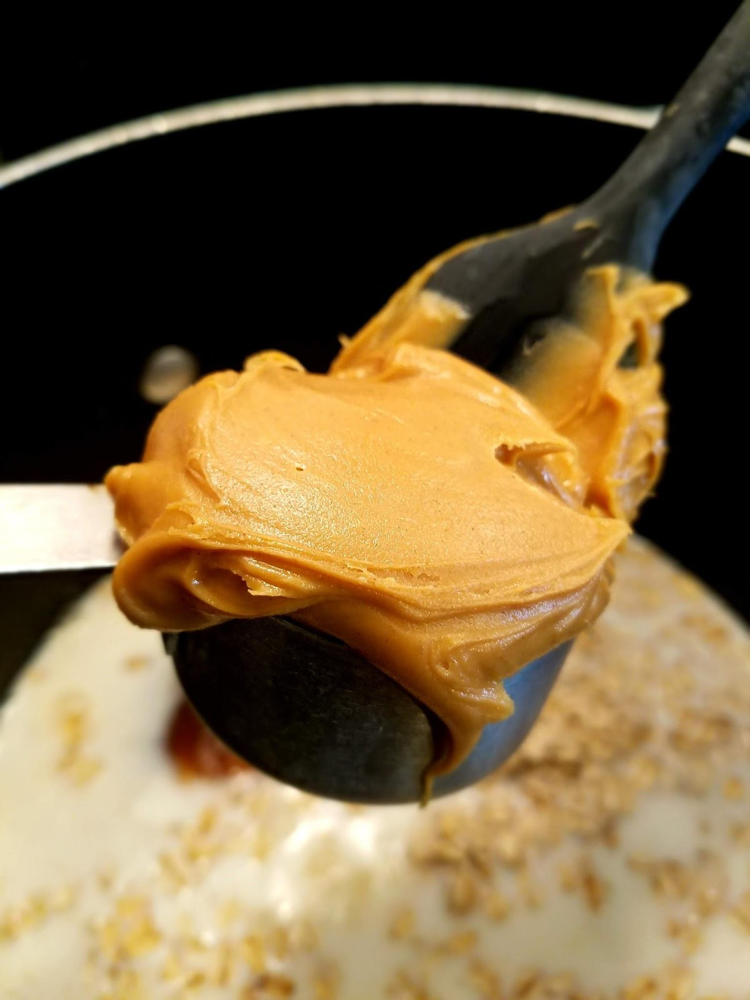
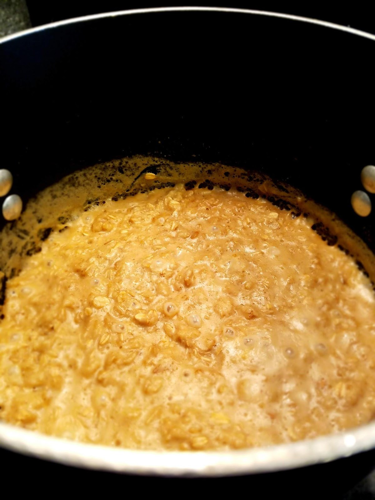
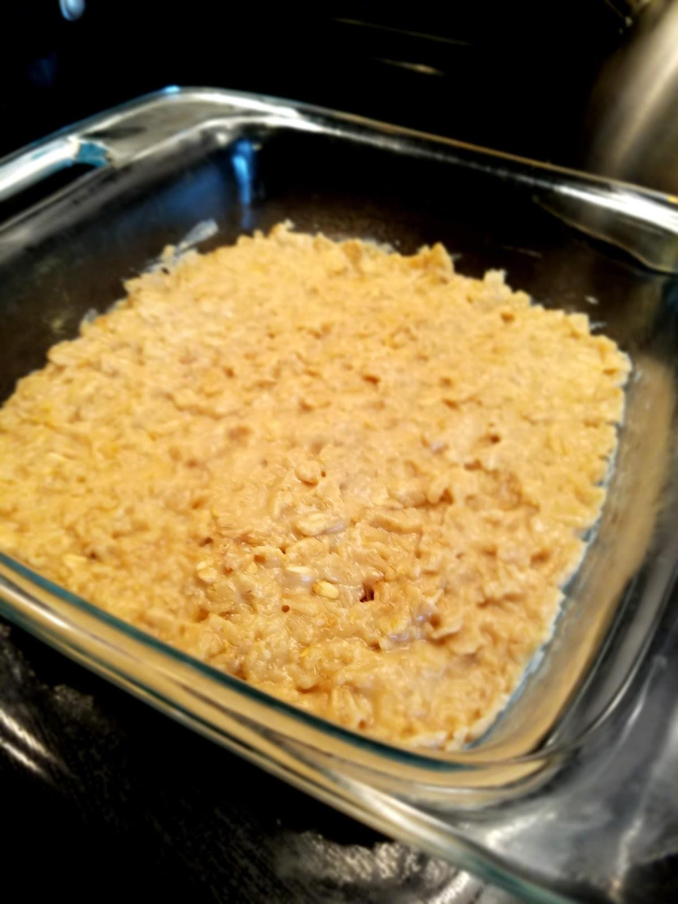
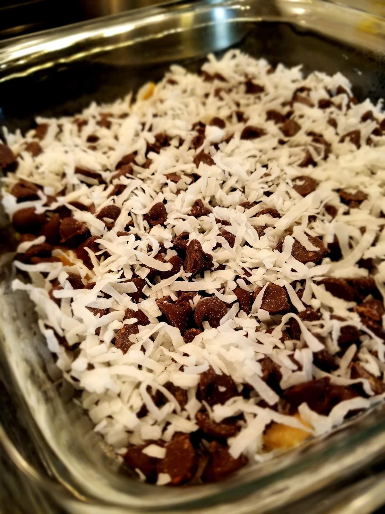
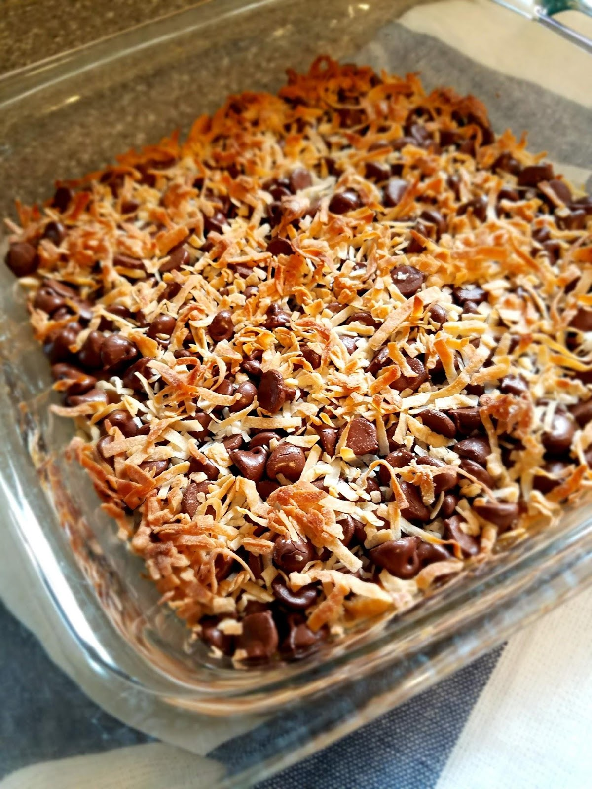
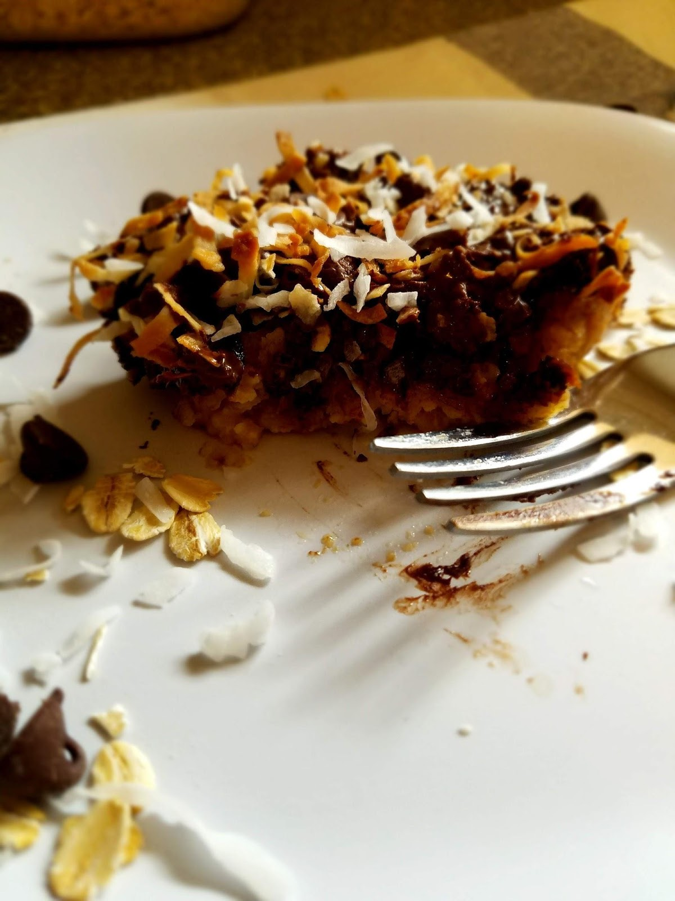

I always feel conflicted about “healthy treats”.

On one hand, if you’ve got health or fitness goals you’re trying to keep and “regular” treats don’t fit into that, then I see where the desire comes in to find something to curb your sweet tooth that doesn’t break the caloric bank.

On the other hand, if you’re going to have a treat, you might as well make it a good one that is worth every calorie, right?

So I pose the question…. Can you have both things simultaneously?

I’ve tried all kinds of nut butter oat no-bake cookies with flax seeds and pure maple syrup, and the greek yogurt flourless banana muffins that use almond meal and other kinds of pricey ingredients. I’ve tried the black bean protein powder brownies. They taste fine, at best.

But am I an extremist who’s on a no-sugar, no-carb, low-fat, vegan, keto, paleo, gluten free diet trying to achieve perfect health and a perfect diet? NO I AM NOT!

I’m just a regular woman in her mid-twenties with a few kids and lots of hobbies who’s trying to stay healthy and active so I can feel good on the daily and live a long and enjoyable life. in other words, I’M A REAL PERSON.

Sometimes that life includes cinnamon rolls (recipe to come!) on Christmas morning, or french fries when I take my kids to McDonald’s once a week in the wintertime to let them run crazy somewhere other than my house! Most the time it includes Salmon and asparagus or grilled chicken salads or tuna on wheat bread and lots of raw veggies, fresh fruit, lean meats, whole grains and healthy fats. And Sometimes it includes eating a bag of sour gummy worms while playing a board game with my husband after my kids are in bed. (Yep, we’re those nerdy people!)

Because life is to be ENJOYED, not just endured.

Eat healthy a lot of the time, and enjoy a treat or a greasy hamburger sometimes.

BALANCE IS EVERYTHING!

That’s what these baked oatmeal chocolate chip bars embody, to me. Balance. There’s fiber and protein and whole grains from the oats, protein from the milk and peanut butter, healthy fats from the peanut butter, and some sugar to make sure it tastes like a “real” dessert. Did we compromise on a few small health fronts to make it taste good? Yep. But does that mean that all the other nutritious aspects of these bars are completely negated? No way! These bad boys will get your digestion rolling! They will keep you full for at least a few hours, and they are as satisfying as eating a chocolate chip cookie, in my opinion.

My kids love them. They will eat them for breakfast some days (When I don’t have time or the energy to make them eggs on wheat toast) and I totally don’t feel guilty about it.

I make these once every other month or so, and enjoy them for at least a few nights. I keep them refrigerated and warm up a piece in the microwave whenever I’m craving it. They reheat perfectly.

The best part? They use ingredients I already have in my kitchen. So easy, so simple, so delicious.

They are soft, chewy, and smooth. The peanut butter taste is very mild, and the chocolate chips get melt-y. The sweetened coconut flakes take on the golden brown of being perfectly toasted and add just enough crunch to make for the ideal third texture.

Don’t like coconut? Leave it off. Add pecans or almonds instead. Or maybe add some cinnamon to the oatmeal and leave off the chocolate chips. You could bake these most of the way and then for the last few minutes add some mini marshmallows on top for a s’mores alternative that kids will really love. You could eat this with some sliced fresh bananas or strawberries. I always have it with a small glass of milk.

Can you use almond, coconut or soy milk instead to make it dairy free? Yep! Works great.

Keep it gluten free by making sure your oats have that special GF label.

Make it even healthier by leaving out the brown sugar and just relying on the chocolate chips for your sweetness, I’ve done that and they are still delish!

If you’re making these for a crowd then double the recipe and it will fill a 9X13 baking dish.

Try them out and tell me what you think!

Preheat your oven to 350 degrees F.

Then start by taking the oats, milk, peanut butter, and brown sugar and combining it in a large soup pot.

Cook on medium heat until milk is absorbed into the oats and it is a thick consistency.

Pour Oatmeal mixture into an 8X8 dish. (spray if you want, I don’t usually)

Then top with desired amount of chocolate chips and coconut flakes.

Bake 30 minutes. Enjoy!

