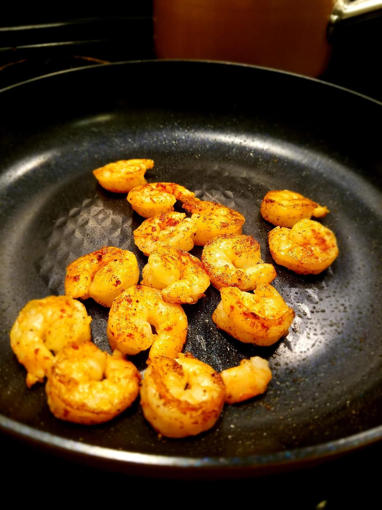
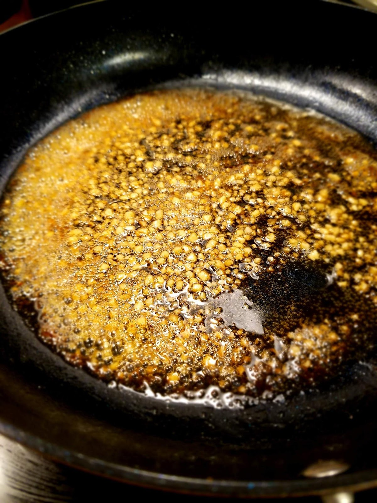
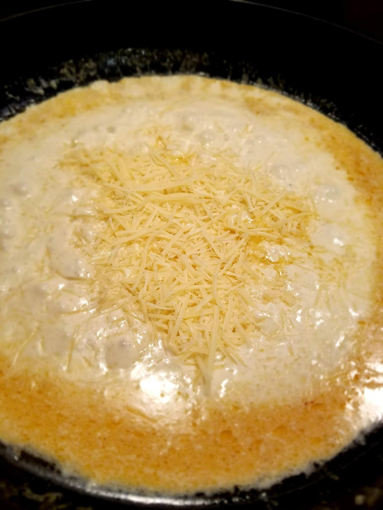
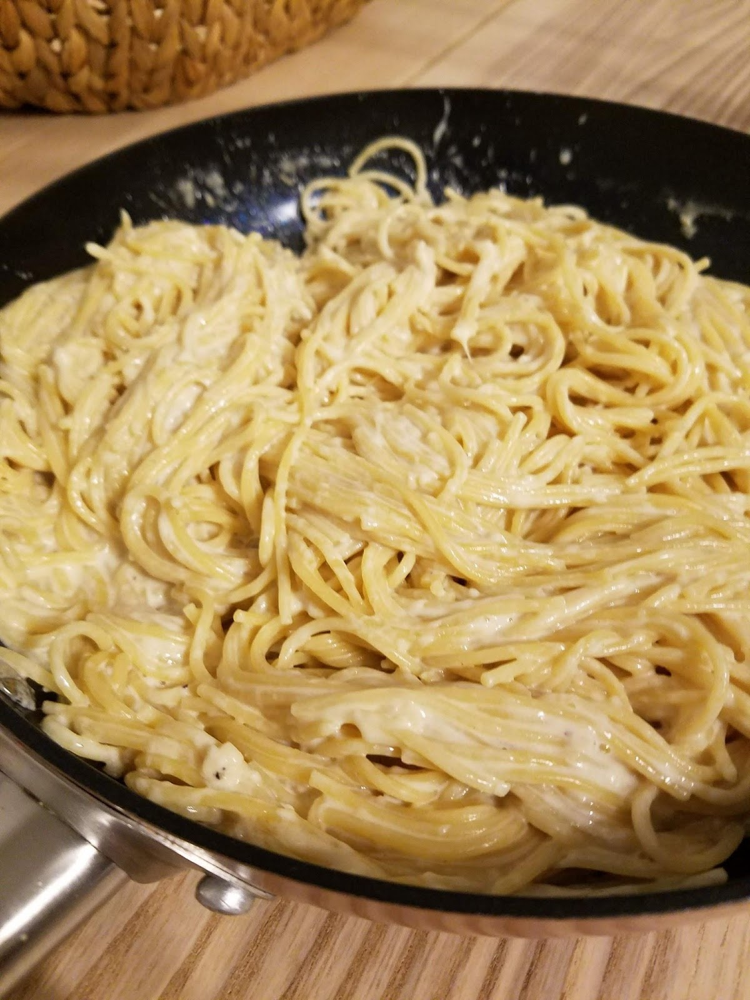

The 20 minute weeknight dinner.

As someone who really enjoys being in the kitchen for both cooking and eating (let’s be honest), most nights I spend at least an hour prepping and cooking dinner for my family. I know, to some of you that may seem like a long time, but to me it’s part of how I wind down for the evening and finish the day. It’s a creative outlet, somewhere I can try new things and explore flavor combinations and cooking techniques. It provides me with a wonderful sensory experience, the sights, the smells, the textures, the tastes, it’s all so enjoyable. Most of all, though, it’s a time for me to be ALONE!

Mentally, I don’t know if there is anything more draining than being with kids (of all ages!). All day long my kids are asking me questions, telling me stories, making huge messes, wanting to cuddle me, climbing all over me, arguing about things, screaming at each other, singing adorable but very loud and off-key songs, and making sure I know exactly what they are thinking at all times.

And don’t get me wrong, motherhood is a joy and each moment should be lived in and experienced fully.

But sometimes I reach a point, usually around 5:30pm, where I Just. Can’t. Answer. Any. more. Questions! I hit my maximum on feigned excitement about every event and story, and I run out of ways to stop the arguing, negotiating, and fighting. I hit a wall, and I JUST CAN”T ANYMORE!

That’s when I go cook.

I turn on a movie for my kids to watch, or some music for them to dance to, or set them up with some puzzles and coloring books, or even just flat out let them run crazy, tearing through my house while I intentionally and completely ignore them. (Trust me, it’s better than the alternative of the mental breakdown they would have to witness and the yelling that would follow it up.)

I walk into my kitchen, and I begin to imagine all the delicious things I could create with the ingredients I have in my fridge and in my pantry. Most days, this is like my “ME” time.

Then there’s the days like today, where I walked into my kitchen with hopeful eyes that landed on a sink that was overflowing with dirty, stinky dishes. They were scattered over the counter and on the kitchen table, there were even some in the playroom! And I completely DEFLATED.

I didn’t have space in my kitchen to be creative, nor did I have the energy to wash all those, which would take at least 30-40 minutes (there were tons of pots and pans that had to be hand washed) and then begin an hour long process of making dinner.

So I did the dishes.

As predicted, 40 minutes later I did not feel like cooking! Especially after seeing all the disgusting things I had scraped off of plates and out of pans from days previous!

On these kinds of days, I turn to my quick, easy, simple meals that I know my family will eat and enjoy. The requirements for this category?:

It’s gotta be 20 minutes or less, start to finish.

It’s gotta be healthier than a frozen veggie pizza (otherwise what’s even the point, right?).

And it’s gotta taste delicious, for my own pride as much as the enjoyment of my family.

This Creamy Garlic Parmesan Shrimp Pasta is one of those.

My family are not big shrimp eaters, I’m really the only one who eats it regularly, but my husband will eat it in this meal and that’s good enough for me. Because this shrimp, combined with the sauce and noodles, is to die for.

And sometimes I get to make MY OWN favorite meals instead of just MY FAMILY’s favorites! No guilt included. And actually, my kids will chow down on these noodles and the steamed broccoli or green salad I usually pair it with.

Now, because my kids don’t eat the shrimp, I make sure to use either a whole wheat pasta or a protein pasta of some sort, such as the Barilla Protein Plus noodles or something similar. Just to make certain we’re all getting our protein in to keep us full. If everyone you’re making this for will eat the shrimp, then just use whatever noodles are your favorite. I always opt for angel hair or thin spaghetti noodles (it’s a texture thing) but this works with any kind of noodles.

Check it out, let me know what you think!

You’ll want to start by defrosting your shrimp. I used large, shell on, frozen shrimp. I dumped them into a bowl of warm water until they were defrosted and the shells came off easily.

Then I started my noodles boiling in their own pot. Note: always add salt to your boiling water when cooking pasta, it makes all the difference to the flavor of the cooked pasta! Promise!

After that, I pull out a large, non-stick skillet and add the oil on medium-heat. Once the oil is heated up, toss in your defrosted, de-shelled shrimp. Cook for a minute or two on each side then sprinkle in some salt, pepper, and paprika.

After your shrimp is cooked, set it aside on a plate or bowl. Return the skillet to the heat and add your butter and garlic. I like to brown the butter just slightly, but that’s optional. The important thing here is that it gets bubbly and the garlic becomes fragrant.

Turn the heat down to Low and add the cream. Once the mixture is bubbling again, toss in the Parmesan as well. I’m always generous with the cheese. Gotta live life, people.

Mix it all together until the cheese has melted and the cream has been incorporated with the butter. Then, toss in your noodles! I suggest putting in small amounts at a time, mixing and tossing as you go until everything has been covered in the sauce.

At this point you may think you’re going to have a really generously sauced dish, but after a minute or two, the noodles will absorb almost all of the sauce, and you’ll want to add in the milk, just to loosen up the sauce again. I find that about ¼ cup will do the trick, without taking away from the richness of the flavor at all.

Then toss the shrimp back into the pan with it and enjoy! We always sprinkle a little extra Parmesan on top, and of course no meal is complete to me without an element of spiciness, so I finish mine off with some crushed red pepper flakes.
