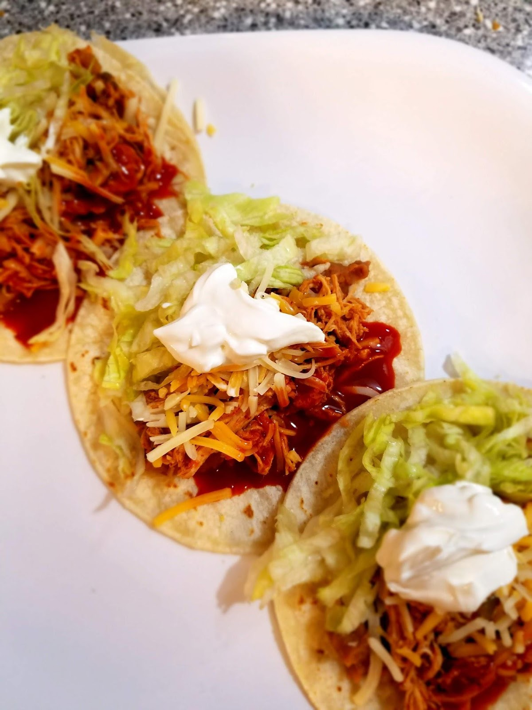

I mean, is there anyone that doesn’t eat some kind of Mexican food at least twice a week? Like really?

And Tacos…Tacos are the real winner.

Living in Southern California meant that there were always at least a few really good, authentic taco shops close by. The real ones, you know, where you get a little nervous you’re going to get food poisoning every time you take a bite, and you have to learn a decent amount of Spanish just to order your food. The good ones usually sell Mexican sweet bread and tamarind soda and old fashioned Coke or Pepsi out of a glass jar.

Some days after our high school classes got out my little brother and I would drive over to one of those and load up on tacos. It was my senior year, when I had a car to take us wherever we wanted to go and some pocket money from my summer job. He would do most of the ordering because he was in first year Spanish and I took French in high school. I should say I Failed French in high school, because if I’m honest, languages are not my strong point. Tacos were important enough though, so he taught me the magic phrases.

Tres carne asada tacos y dos pollo tacos, por favor. Con salsa verde. Gracious!

And…. that’s it! That’s all I had. Just enough to get me some tacos and make me feel like I wasn’t a total outsider in a taco shop.

But that wasn’t the only kind of taco I ate on the regular. There was also a coastal taco shop called Chronic Taco. The guacamole and homemade flour tortillas were incomparable. Those ones were definitely Americanized (or Californianized, I guess, because it was all surfer guys working there), but I’m not here to judge! Just to enjoy. That place was a favorite stop on the way home from a day at the beach on the weekends, or a go-to place for my family (all seven of us!) for dinner on Monday nights (there was one a few minutes from my house too!). My dad was a master of loading his tacos with so many ingredients that the taco itself had to be eaten in sections or it would explode all over the tray.

Then there’s the very controversial Del Taco. I’m going to be honest. I’m a fan! I know all the Taco Bell fans are ready to leave my blog and never come back, swearing their loyalty to the nacho cheese sauce with hands over heart, but hear me out. There’s room for us all in this world! Plus, there’s no Del Tacos in Indiana, and so I’ve had to adjust to the dollar menu at Taco Bell instead. I enjoy a few crunchy potato tacos or cheesy bean and rice burritos on occasion. But for me, there’s nothing like the fresh shredded cheddar cheese and the famous Del Inferno sauce of good old Del Taco.

I played water polo in high school, as well as competing on the swim team. My best friend (a senior during my sophomore year) and I had exactly thirty minutes between the end of the school day and the start of practice and we used that time almost every day to race to Del Taco in her neon green Volkswagen Bug and use the change in our wallets to order some soft tacos and a fresh strawberry lemonade. We’d scarf them down and then hop in the pool and try not to get sick as we worked our butts off for the next two hours trying to break our 100M freestyle sprints or work on our shots into the goalie box.

Then there were the home cooked tacos. My dad has mastered the art of homemade tacos. Everything I know about cooking tacos comes from him. His ground beef tacos, with tomato sauce and every spice in our cabinet, served over flour tortillas with cheese and hot sauce, were a weekly staple. Sometimes he’s switch it up and use cubed chicken and we loved those too. One Christmas he really outdid himself. He had fought hard to earn the right to host the Family Christmas Eve party at our own humble abode rather than at his parent’s house. But instead of a ham and cheesy potatoes and the traditional works, he whipped out the grill on that sunny Southern California day and BBQ’d some marinated carne asada. He added some shrimp cooked on the skillet and we had a Christmas Eve Taco Party! It was the best ever. Did I mention that we have no Mexican background whatsoever? He’s just that cool!

So you see, tacos are a very prominent part of my upbringing. I could eat them every day, and there’s so much variety! I mean, the list of different kinds of tacos could go on forever, only limited by your imagination and the ingredients available to you.

THESE chicken tacos have to be one of my favorites to make at home. Why I love them?

They are easy

Kid friendly

So flavorful and

Can feed a crowd easily

I’ve used this recipe for family gatherings, friends game nights, kids birthday parties, or just dinner with my family of four (almost five). Not to mention they make fantastic leftovers! The next day we’ll toss the chicken into quesadillas, eat it over nachos, or roll it into some baked taquitos (recipe to come!). I throw it on a salad with some sliced bell peppers, tomatoes, cucumber and some good old ranch dressing for a light lunch. Or make more tacos! So you see, you can’t go wrong.

What makes these different from any other crock pot chicken taco?

A little something I call the perfect blend of spices and a nice can of green chilies. You wouldn’t believe how much flavor that one can of chilies can bring to a crock pot full of chicken!

You start by tossing in 2-5 chicken breasts into a crock pot. Frozen or thawed, either is fine, and cover them with your favorite jar of salsa. If you’re using 2-3 chicken breasts, then a single jar of salsa will probably suffice, and if you’re making it for a crowd and using 4-5 chicken breasts, then I would recommend having two jars on hand. You’ll use at least half of the second jar.

Cook it on low for 7-8 hours, or on high for 5-6 hours. I toss mine in around lunchtime and it’s ready by dinnertime!

Once it’s cooked, shred it up! Then amp up the flavor. Add in your chili powder, garlic powder, onion powder, seasoned salt, black pepper and cumin. Pour in your can of green chilies (hotness to your preference. When I’m feeding kids with this I keep it mild, but otherwise the hot green chilies are delicious.)

Mix it all together and Viola! You’ve got your taco meat.

I also almost always eat these with some of our favorite refried beans. I know refried beans have a reputation for containing poor ingredients, like lard, but these ones are totally clean! There’s no added fats or sugars, just pinto beans and some spices. They make a great filler to add into the tacos and make the chicken stretch further for a crowd, and they add a delicious texture and flavor to the tacos! I buy them at my local Kroger or Walmart in the Mexican food section (I’ve seen them at most grocery stores though.)

You can serve these up however you like! My family eats them with flour tortillas, sour cream, beans, cheese, shredded lettuce, and some taco sauce or hot sauce. Those are the basics.

I have found a few healthy-hacks for these and I like to use these swap outs to decrease the fats and carbs for this meal to suit my personal goals and preferences.

Sour Cream → Plain greek yogurt (I can’t taste a difference, truly, it’s like magic)

Flour Tortillas → corn or whole wheat tortillas (I prefer corn), or pop these babies into a lettuce wrap!

Cheese → just skip it (how committed are you to those goals? This is the ultimate test!), or use part-skim mozzarella cheese.

I also sometimes squeeze some fresh lime juice on mine or we top them with chopped bell peppers, fresh cilantro and diced tomatoes to add some more veggies.

Try them out! Let me know what your favorite toppings are for chicken tacos! What would you add? What would you leave out? What kind of salsa did you use? What’s your taco history? (We all have one).

