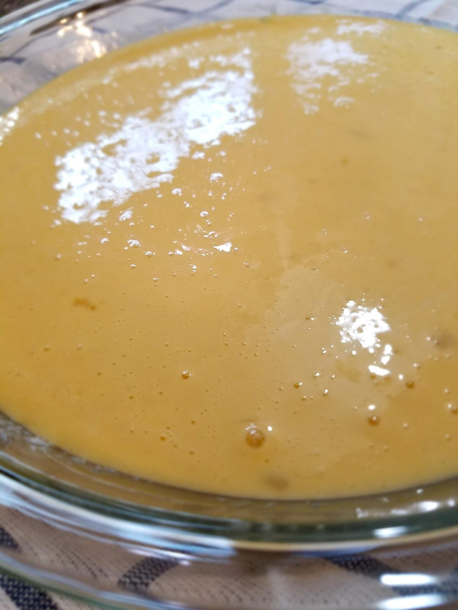

I have officially hit the nesting phase.

I’m about 36 weeks along with my third baby, and every day feels like I am digging myself deeper into the hole of insanity. I don’t understand how my belly could possibly get any bigger, or stretch any more! And yet, there are still four weeks left of growth to go.

At this point in my pregnancy I am exhausted all the time, always hungry, hips and back are aching, abdominal discomfort through the roof, frequent trips to the bathroom, digestion slowing down, water retention, mood swings taking me up and down faster than a roller coaster, headaches, heartburn, and other things I’m sure you’d prefer I not mention but know all too well if you’ve gone through this before!

So where does this sudden burst of energy and anxiety come from urging me to “Nest”?

I’ve got a running to-do list that includes (but is not limited to):

Wipe all walls and doors

Mop and steam all floors

Wash all bedding thoroughly

Wash and fold all baby clothes

Set up crib/bassinet

De-clutter house

Stock up on baby soaps, lotions, diapers, wipes, creams, powders, etc.

Stock up on hygiene items for the rest of us

Stock up non-perishable food items

Stock up freezer

Make freezer meals

Pack hospital bag

Pack other kid’s bags for my hospital stay

Get all necessary shots for all my family

Stock up cleaning supplies

And

The

List

Goes

On

I mean, really, it’s excessive right? Is the baby going to notice if my walls are clean? NO. Is he going to care if I have a five month supply of lotion? NO. Do I feel the need to do all these things anyways? YES! WHY?

The only thing I’m grateful for about this whole “nesting” thing is that it keeps my mind occupied so I don’t spend my days in bed grumbling over every ache and pain.

Want to know something ironic? I was having some dizziness (on top of everything else) and I was so concerned about it, until my ear started hurting. It dawned on me, it’s probably just a little ear infection! And I laughed out loud! Because it’s been so long since there was anything wrong with my body that did not involve pregnancy. It made me feel like a real person again instead of just an incubator. Thank you ear infection….

I know, I know, some people love pregnancy. They feel whole and glowing and purposeful. It’s a sweet experience with so much sentiment and novelty. I know people like this, and I wish that I could feel that way! I really do!

Here’s a story to explain one of the many reasons that I do not.

Yesterday I was out and about during the day. Got all dressed, winter boots and everything, and took my kids to the store, went grocery shopping, let them play at a fast food playplace with some friends of ours, etc. Well, I got home around 4pm. My feet were aching from holding me up all day and my jeans were feeling much too restrictive. I was dying to take my boots off and slip into some pajama pants and fuzzy slippers. I sat down to take off my boots, and because my feet were swollen from the day’s errands, and because my belly is so big and my hips are so dysfunctional, I could not get my boots off. Literally was not able to.

I had to wait almost four and a half hours for my husband to get home (he had to work late) so that he could take my shoes off for me!

I almost cried as he pulled them off my swollen, pregnant feet. Then, of course, he had to help me take off my maternity skinny jeans too, because who did I think I was, trying to take off my own pants?

This is pregnant life. And I am not a fan. The only thing that gets me through it is knowing the sweet little soul that’s going to join our family at the end of all the struggle. It will be worth it. So so worth it. But right now it sucks. Amiright?

Some days I cave into all that hunger and those hormones and I let myself take a meal to eat my feelings. Earlier this week, I had one of those days and I just needed some German pancakes to get me through the day.

Luckily for me, I have a delicious German pancake recipe!

For these, I always start by melting the butter onto the baking dish. (I used two smaller baking dishes, but this recipe is sized for a 9X13 baking dish. The pie dish is prettier, though, so that’s what I photographed.)

Next up, get a medium sized mixing bowl and combine the flour, milk, salt, and sugar (if using).

Mix this until smooth, then add your eggs. DO NOT OVER MIX YOUR EGGS! It will totally change the texture of your German pancakes. Mix until just combined.

Then pour into your baking dish.

Bake at 375F for 25 minutes. Then remove and allow the gorgeous fluffiness to slowly sink.

Is there anything that looks and smells better in the morning than a fluffy German pancake Fresh out of the oven? I think not.

Serve them up! I prefer a little powdered sugar and some fresh berries with a drizzle of honey or syrup.

