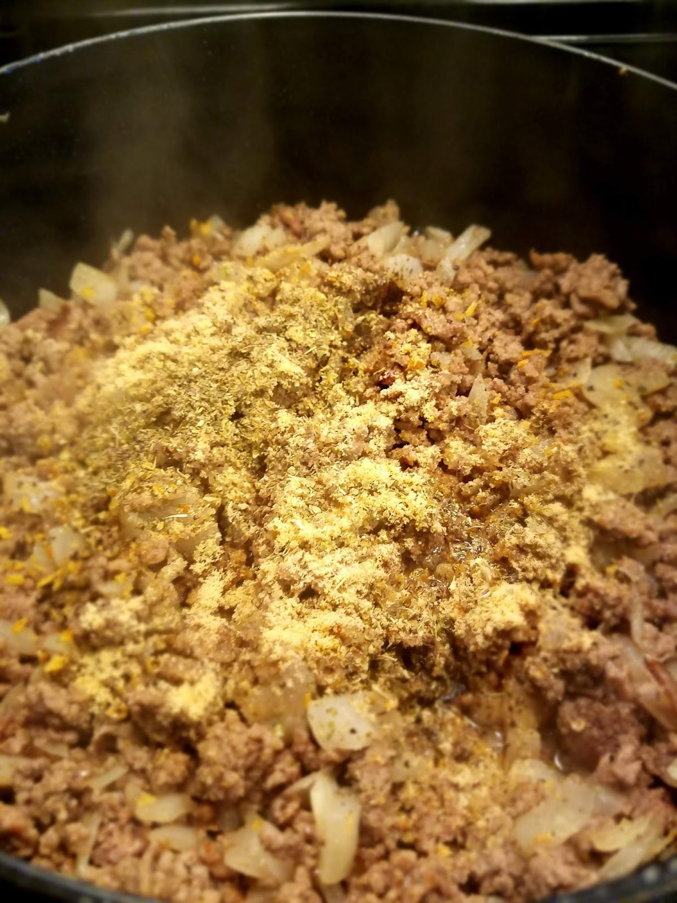
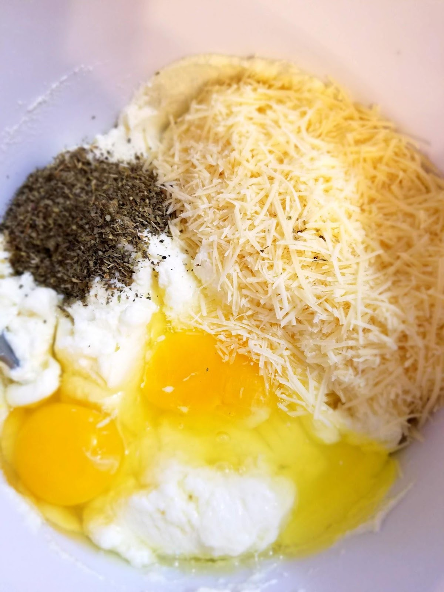

Lasagne. It has to be my favorite Italian dish. By far.

In September of 2018, my husband and I took advantage of the fact that our then youngest was 2 years old and I was neither pregnant nor breastfeeding. We knew we wanted to start trying for another baby come the end of the year, and so it seemed like it was a “now or never” kind of situation. So we did it.

We went to Italy. For 11 glorious days with just he and I, no kids, no pregnant problems, no strollers, no car seats, nothing but the two of us and our hunger for adventure and romance. And food, of course, because it’s Italy. Duh.

It was the one place we both agreed on almost instantaneously when we researched where in the world (because it could have been anywhere in the world!) we’d both wanted to go spend 11 days together. We thought of London and Ireland and China and Japan, Africa and India and even the Caribbean! All places we want to go someday, but none of them beat out Italy.

With the combination of the history, the weather, the destinations, the art, the culture, and most importantly, the FOOD, it really was a no-brainer for us.

We spent three days in Venice, three days in Florence, and another three days in Rome (with two full travel days on both ends). It was magical. We went to the palaces, the museums, the side streets, the restaurants, the boats, the countryside, the vineyards, the rivers, the trains, the Colosseum, the bridges and art galleries. Each place was so different and so fun to explore. We fell in love with all of it, and we were reminded of why we were in love with each other, after 5 years and 2 kids and being poor college students for all of that time.

What I fell in love with the most, though, (and my husband will agree) was the lasagna.

No matter where we went, the lasagna was always delicious. We had a system worked out. I would order something new and exciting at each restaurant, and he would order the lasagna bolognese, and we would share them and compare. Well, it didn’t seem to matter what delicious thing I had ordered, the lasagna was always the better dish, by far! And we tried good stuff! Seafood pastas, spicy chicken dishes, pizzas, bruschetta, Alfredo, salmon, even chicken Parmesan! They were all so good my mouth waters just thinking about them. But the lasagna was always better.

I couldn’t even tell you why. I don’t know what magic they use to make those, but every single restaurant had magnificent lasagna. I have missed it dearly.

I’ve tried to make this more authentic. I’ve tried to find the ingredients they used and cut them fresh and cook them from scratch. I’ve tried to imitate the exact use of the spices or the lengthy and complicated process of making a good bolognese sauce. I’ve tried and I’ve ultimately failed. That goal is now on the back-burner, where I can revisit it someday when I have more money and more time to really hash it out and make it like they did in those small family-owned restaurants in the backstreets of Italy.

Is this recipe close to the ones we had there? Definitely not!

Is it a delicious meat lasagna recipe that’s fairly easy and totally freezable? YES IT IS!

It has the layers and the creaminess and richness, the textures and the flavors of a delicious homemade lasagna. All for minimal work and cost. That’s a winner in my book!

I’m due for a baby pretty soon here and throwing a homemade lasagna in the freezer is part of my nesting process. I’ll probably do a few more freezer meals in the coming weeks, but this one has to be my favorite, so it made it first! It will make the sleepless nights and strenuous days adjusting the three kids a little easier for at least a few minutes one evening.

These ingredients are enough for two 9X13 pan lasagnas. One for dinner, and one for the freezer! (I suggest using a disposable tin pan with a lid for your freezer lasagna, for convenience and easy storage.)

Begin with your noodles. Cook 19 (one extra, just in case) lasagna noodles according to package directions. To make your life easier, I suggest seasoning your water with some salt, and then quickly pouring in a few teaspoons of olive oil to keep your noodles from sticking together once removed. And don’t overcook the noodles. Follow the package directions!

Next, in a large skillet or a wide, shallow pot, get your beef cooking. This is two pounds of ground beef (80% meat 20% fat, what I always use for best flavor and texture).

Chop up your two onions and toss in with the meat as it browns.

Cook on medium heat until browned. Really browned. Like onions are getting crispy around the edges and there’s really good dark color on most of the meat. Let it fry a little bit, if you know what I mean. All the water should be cooked out and evaporated before you go to the next step.

Then add in your spices. My secret weapon for most recipes that have ground beef in them, including tacos, hamburgers, and any kind of Italian meat sauce or meatball, is Montreal Steak seasoning from McCormick. I don’t know what they put in this stuff but it makes any ground beef dish so much tastier. It’s the perfect combination of spices and pepper and salt. The rest are just your basics, garlic powder, onion powder, Italian seasoning, etc.

Mix and keep cooking until you are CERTAIN that all the water from the meat has evaporated, then pour in your favorite pasta sauce. We love Classico Fire Roasted Tomato and Garlic, so that’s what we use. We also like their Spicy Tomato Basil, or their Roasted Garlic sauce. Any 24oz tomato based pasta sauce will do.

Lower to low heat and bring to a simmer. Cover and keep warm. At this point your noodles should have finished cooking and should be fairly cooled off somewhere. Have those on hand.

Next, prepare the ricotta mixture. Put the Ricotta, eggs, Parmesan, and Italian seasoning into a bowl and mix until well combined.  
(You can sub out half the ricotta for cottage cheese, but we prefer the creaminess of the traditional cheese.)

After this, get your mozzarella out of the fridge because you’re ready to layer!

Oh, and don’t forget to preheat your oven to 350F.

Grab a 9X13 baking dish and whatever you’re using for your freezer dish as well. Spread a thin layer of meat sauce (really thin) on the bottom of the pan, and then cover with three lasagna noodles.

Next, divide your ricotta in half and use half on each lasagna dish, spreading evenly across the noodles. (Be gentle here, and use the back of a spoon or a rubber spatula to ensure the noodles don’t move around with the spreading). Top with a thin layer of mozzarella.

Add three more noodles, and then spread half the sauce on each dish, using up all of it.

Then top with another layer of noodles, and cover with the remaining cheese and an optional sprinkle of Italian seasoning.

And viola, you have a lasagna! Actually, you have two! My freezer-ready lasagna is in a disposable tin baking dish that came with a lid.

I popped that one in the freezer, and then I popped the glass dish into the oven and baked it for 30 minutes.

I love the gorgeous golden brown color of the cheese on the edges, and the way the sauce is simmering through the cracks. Perfection.

Serve it up! We usually eat this with some veggies. I love a good Cesar salad, or a simple green salad. Sometimes we have it with steamed broccoli or fresh sauteed green beans or asparagus. Heck, even just some canned green beans with a little garlic salt will do the trick!
