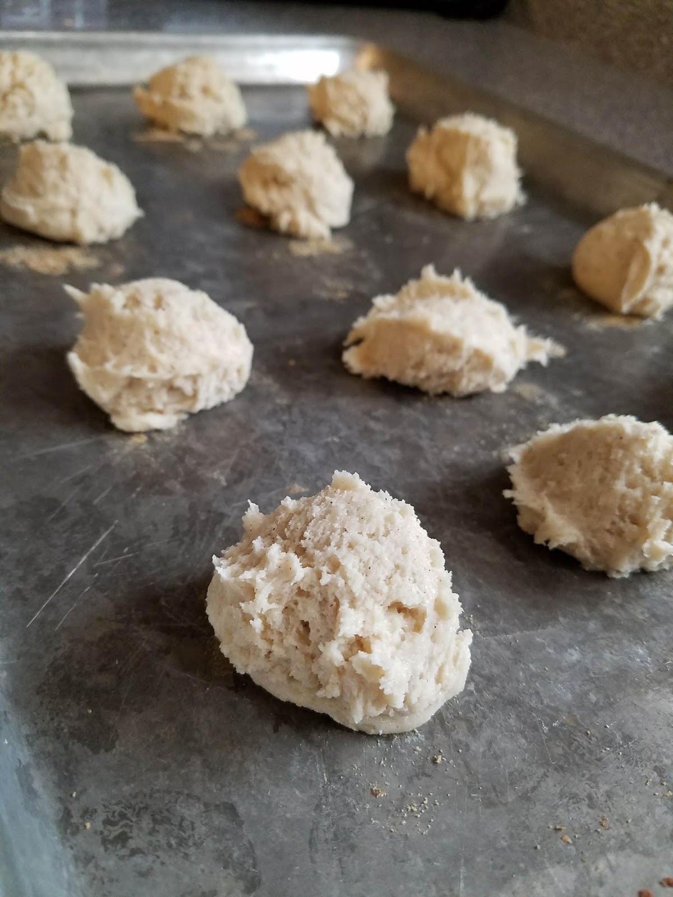

These are from my husband’s paternal grandmother, which, in my house, is Great Grandma. Or, as my kids call her, “Grandma Great!”

His grandma is famous for several of her recipes, and this is one of the most popular.

When we were getting married, my husband’s mother threw me a bridal shower in Utah with all of the women in my husband’s family since all of my family and friends were in California (bless her generous heart). It was held at his paternal grandmother’s house (My mother-in-law’s mother-in-law….I know…It’s like inception) and instead of making things difficult and trying to guess my taste for home decor or spend a fortune on items from a wedding registry, she hosted a Recipe Shower. GENIUS! It was the best idea ever. Not only because I knew already at that point in my life that I wanted to explore cooking, but also because it really helped ease the awkwardness of fitting in to a new family, especially one that was so very different than my own.

How it worked:

Everyone brought a written or printed version of their favorite recipe along with the non-perishable ingredients for the recipe. Some guests even brought some of the cooking utensils or bowls/pans used for the recipe to amp it up a little bit.

Why I loved it so much:

It gave our pantry a little head-start as college students that were now newlyweds and totally broke (like so broke……I can’t even explain how many government aids we qualified for based on our income, student status, and marital status).

It gave me tons of new recipes to try, many of which my husband had already had and loved from eating with members of his family.

It started us off with some good mixing bowls, wooden spoons, silverware, pots, cutting boards, etc.

It helped me get to know those members of his family! As I opened each person’s present/recipe they were able to explain the recipe, the ingredients, why they loved it, and sometimes even share a memory about a time they’d made it or eaten it!

It was oddly personal and really wonderful! Mostly because his family is totally stellar, but also because, like they say, food brings people together better than almost anything!

This particular recipe from his grandmother, Connie, came on a bright neon orange index card, hand written, along with the non perishables and I believe she also sent me with a cookie sheet!

I didn’t try it for the first few years of our marriage, mostly because I had so many recipes that I still don’t think I’ve gotten through all of them, 7 years later.

My first time eating these cookies was at her house, a year into our marriage. We were staying at his grandparent’s house overnight for a family event of some kind and my husband and his brothers (and me, admittedly, though not nearly as frequently) were constantly sneaking into the freezer to eat the buttermilk cookies she had made in bulk and frozen the day before. I swear they each ate at least 8 cookies before we left the next morning.

These cookies use shortening, rather than butter, which is one reason I was hesitant to bake them at first. I don’t use shortening for anything else, and I much prefer the taste of butter. They also are a dough that has to be chilled before baking, which means I have to be patient! Which I am usually not.

But once I tasted them I was sold. These are absolutely Delicious!

They are so light and fluffy, almost more like a biscuit than a cookie. They have the perfect amount of sweetness to balance the tang of the buttermilk, and, as I learned from my husband’s grandmother, they freeze really well! So when I make these, I make a double batch.

The butterscotch chips are controversial. In my experience with making these, some people absolutely love the butterscotch chips, and some people can’t stand them! I, personally, have to be in the mood for them, otherwise it’s too much. I don’t think you can know until you try them.

The other option is to mix some cinnamon in with the batter. This is my favorite way to eat them. I don’t know what it is about the combination of the buttermilk and the cinnamon and the fluffiness, but these really remind me of something more like a pancake rather than a cookie, and I am here for it! Fresh out of the oven, the cinnamon buttermilk cookies are DIVINE!

To start these off, use an electric mixer to beat together the sugar, shortening, eggs and vanilla.

Next, add in your dry ingredients.

Once the dough is thoroughly combined, add your butterscotch chips or cinnamon, and then refrigerate for at least two hours. (I know, it feels long, especially if you tasted the batter, but it’s worth the wait!)

Butterscotch Batter

Cinnamon Batter

After the full two hours has passed, use a cookie scoop to form the cookie balls. I’ve tried to scoop these without a cookie scoop and they are a total mess! Still delicious, but a mess. Proceed at your own risk.

Butterscotch Cookie Balls

Cinnamon Cookie Balls

Bake 400F for 8-11 minutes, until the bottom is slightly golden and the tops are no longer shiny (whatever that means).

I recommend eating fresh and then freezing. These are so good right out of the oven, but after the first day out of the oven they lose a lot of their appeal (Like eating a second day biscuit….not it’s best moment), so freezing them after that keeps them fresh. Warm up in the microwave or eat them frozen! We like them both ways.

