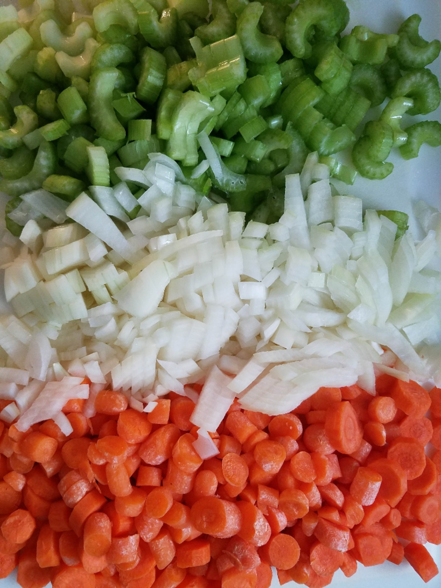
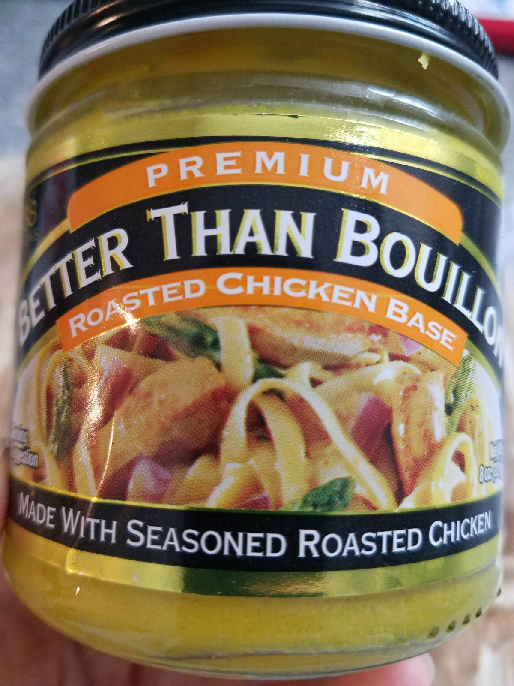
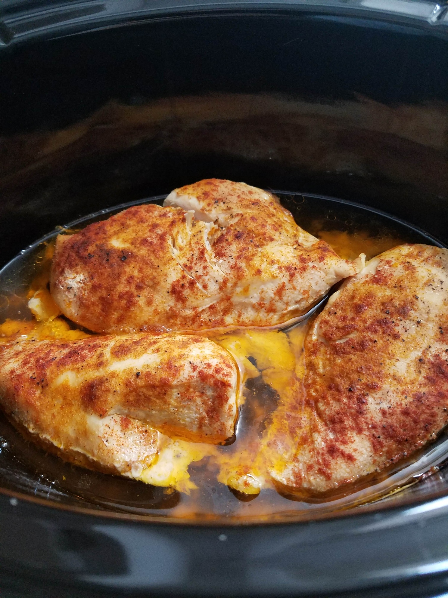
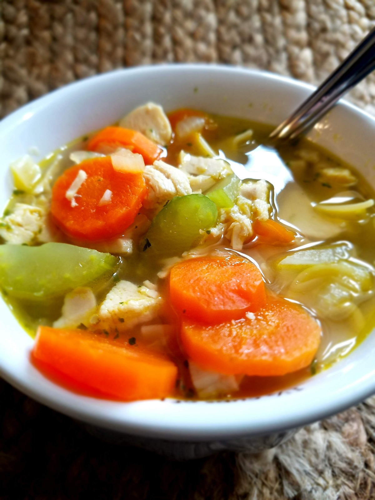

Some days I want to put all the work in. I look forward to the challenge of a complicated, detail-heavy recipe. I want to dig in to the process and spend an evening stirring sauces and sauteing vegetables to perfection while the meat dish simmers, needing basting and seasoning. The twenty steps in the instructions are not intimidating but exciting, knowing that all that hard work and time spent will turn into something delicious that I can share with the people I care about.

And then some days, like today, I just want to make it as easy and low-maintenance as possible! Like a one-dish meal, or a 20 minute dinner, or a freezer crockpot meal. Or even just takeout, you know what I mean? Especially now, as I sit in the last few days of my pregnancy just feeling like I take up as much space as a small planet and the aches and pains are overwhelming, I just want the cooking process to be quick, simple, and use as few dishes as possible.

Like, does anyone else use paper plates on a regular weeknight just so you won’t have to do dishes? Guilty. A thousand times. I wish they made disposable pots and skillets because let me tell you! I am so tired of washing those suckers! They can’t even go in the dishwasher! My laziness is telling me that there’s a better way. There’s gotta be a better way.

This chicken noodle soup recipe is not one to rival your grandmother’s. It doesn’t use any bone broth. It’s not a "simmer all day to get the nutrition and flavor out of the chicken and vegetables" kind of recipe. There’s no homemade egg noodles (although those are delicious). In fact, I think the most extravagant part of this recipe is chopping the vegetables!

Now, I have done this three ways to see which one was the most cost effective and time-saving.

I’ve bought a rotisserie chicken from the grocery store and carved it and chopped/shredded all the meat and added it to the soup. That works totally fine, although the carving process is a little gross and messy for my taste, and it is not the cheapest per-ounce as far as chicken goes. It tastes good, though, and you don’t have to cook it yourself so that’s a win.

I’ve also bought chicken breasts and cut them into chunks and cooked them at the bottom of the soup pot before adding the vegetables and broth. That is more cost-effective but a little more hands-on because cutting raw chicken is a pain in the butt! It also, in my opinion, doesn’t give you the best-tasting chicken. It’s just not the same effect as the shredded chicken that gets fully incorporated into the soup (which is my preference to the big chunks). But it works fine.

Despite those two ways being fine, my favorite way to get the chicken exactly how I want it with the least amount of work, is by using my slow cooker. Now, I know some people are instant pot die-hards and that’s great! Use that if that’s what you prefer. I personally love smelling the food cook all day and I love how tender and flavorful the food gets from the slow cooker. People will fight me to the death on this, but it is not the same! The instant pot cooks it through, yes, but it does not give the same effect as the slow cooker. Sorry! You can’t change my mind. I side with the slow cooker for this recipe.

The way this works best is to put the raw or frozen chicken into the slow cooker and then sprinkle with garlic salt, onion powder, paprika and ground black pepper. If you don’t add the seasonings then the chicken doesn’t get the same flavors as it cooks and it also doesn’t smell nearly as good while it cooks. Then you just set it for like 6 or 7 hours on low and let it do its thing. For this recipe I would recommend using two large chicken breasts or three small ones. That seems to be the right amount for the broth to vegetables/noodles/chicken ratio.

Also, a new hack I discovered! Once your chicken is done in the slow cooker, leave it in there and just use a hand mixer to get it perfectly shredded! It takes like 30 seconds and is SO MUCH EASIER than chopping or shredding it by hand. BEST HACK EVER.

That’s my recipe. Chicken in the slow cooker, the rest cooked on the stove in a pot, then add in the chicken at the end.

So here we obviously start by putting the chicken in the crockpot several hours before you intend to eat and sprinkling your desired amount of seasonings on it.

Then about 30 minutes prior to eating, prep your veggies and toss them in the pot with the oil.

Next up, once those are tender and fragrant, add in the water and the broth paste/powder.

Bring it all to a boil and then shred/chop your chicken.

Bring to a boil again and toss in your noodles. Cook until soft and you’re ready to go!

