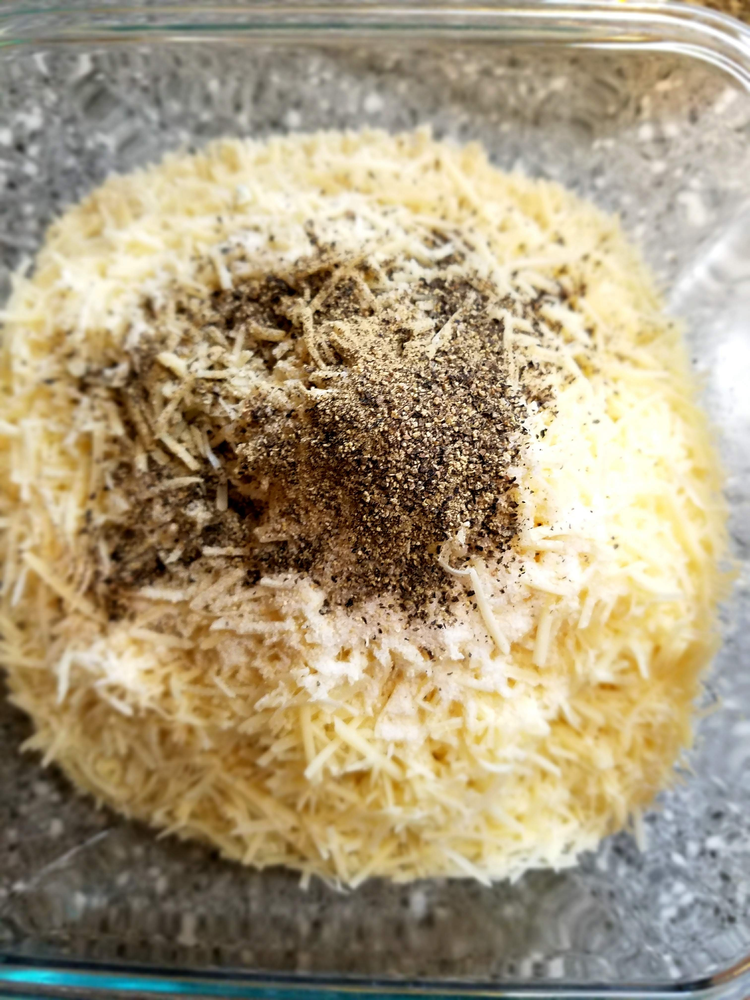
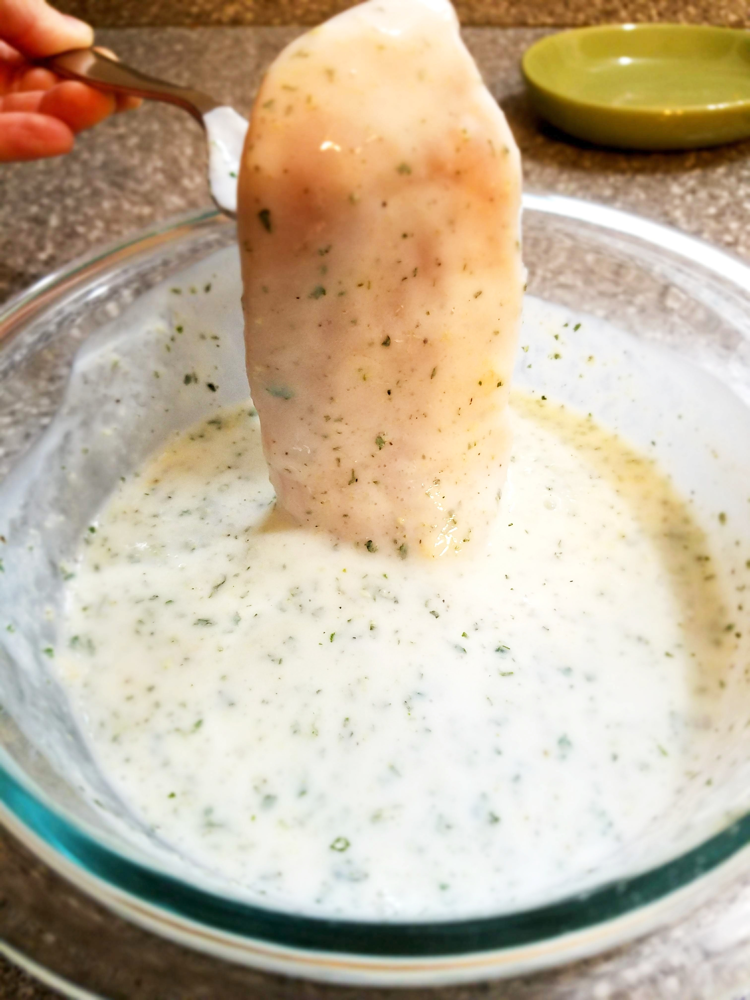
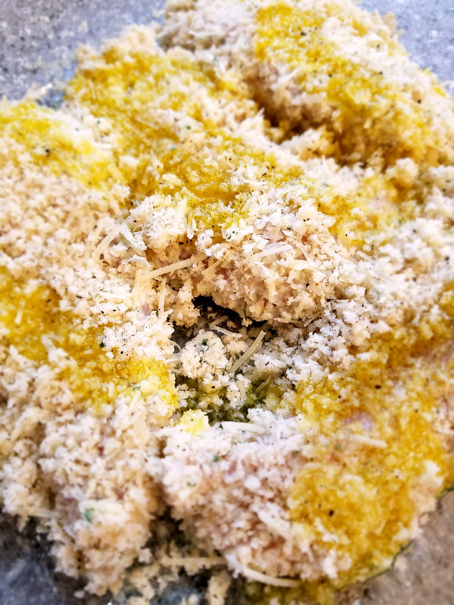
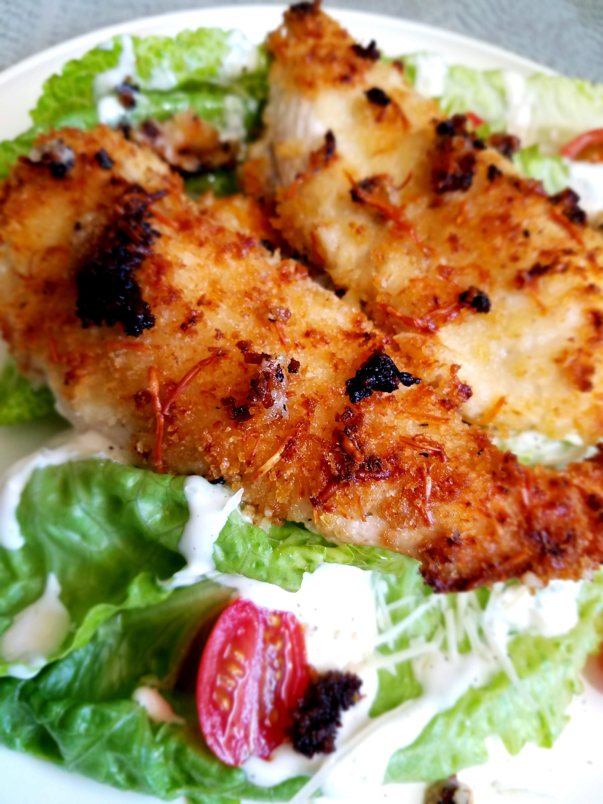

I don’t know if there is anything I love more than a good, breaded, battered, salted fried chicken tender.  They are my favorite thing to order at fast food places or burger joints, and when I was a kid I think it was basically all I ever ordered from restaurants.  

Why is fried chicken so good?  

And why does it also have to be so bad for you!????

It’s a predicament to say the least.  

Growing up my dad was really good at making a pan-fried “panko chicken” dinner that we all loved.  There were a few places I liked to get the fast food chicken tenders in California, but I never had a favorite.

When I moved to Logan for college, my husband and I discovered a restaurant called Angie’s.  They claim to be where the locals eat, and it's the truth!  If you walk in there on any weekday morning, you’ll see farmers back from their morning work eating fried eggs and hashbrowns, and on the weeknights it is packed with families from the valley.  On weekends you’ll find groups of college students there, attempting to “clean the sink at Angies” (eat a huge trough of ice cream to get a bumper sticker).  What else will you find?  THE BEST CHICKEN STRIPS EVER!  They are thin and crispy and flavorful, and with the state of Utah’s famous Fry Sauce, there’s nothing better.  

Now that I’m in Indiana I haven’t found my chicken strip place yet, so I only have them on occasion when my kids are losing their minds on a winter afternoon and we make a Mcdonald’s trip so they can run free at the playground.  

I think I could eat good chicken tenders at least once a week.  And when I have morning sickness (like I did with all of my pregnancies) and I can’t stomach almost anything, I can still eat chicken tenders!  Or any kind of fried chicken.  It’s like the only thing besides grilled cheese sandwiches and pizza that I can keep down.  WHY?  I HAVE NO IDEA.  

It is what it is.  

The aspiring cook in me has tried so many times to make good homemade chicken tenders.  I’ve tried so many techniques, used so many different recipes, and it has never turned out quite as good as when I eat out.  Maybe because I refuse to own a deep fryer in my house (for my own health).  

But, I have to say, these parmesan baked chicken tenders are pretty good.  They are much healthier than a typical piece of fried chicken, but they get all the crunch that you’re looking for without all the oil!  They are really easy to prepare, and they are one of my favorite freezer meals (which I made a lot of pre-baby #3)!  

The parmesan cheese and seasonings mixed into the panko bread crumbs adds so much flavor, and the baked chicken gets tender and doesn’t dry out.  You can make these in bulk for a crowd, or just for a small weeknight dinner. 

We almost always eat these with an alfredo noodle or a marinara pasta, sort of as a substitute for the traditional Italian “chicken parm”.  These also make a fantastic topping for a big Ceasar Salad, which is my favorite way to eat them. They do have a more Italian flavor, thanks to the parmesan, but you could use them with any sides that you’d like.  

You start with trimming your chicken breasts, slicing them into the approximate size of tenders and removing any fat.  (or you could just buy chicken breast tenders, but it’s slightly less cost effective).
Then get your “batter” station ready.  Pour your ranch into a dish, then mix your parmesan, panko crumbs, and seasonings into another dish.  Then you’ll grease a 9X13 baking dish so it’s ready to go! 

Dip each piece of chicken into the ranch and then again into the parmesan mixture.

Arrange in your baking dish and drizzle or spray with olive oil.

Bake for 30-35  minutes till chicken is done inside, then broil on high for 2 more minutes, till the top is golden and crispy.  And voila.  

