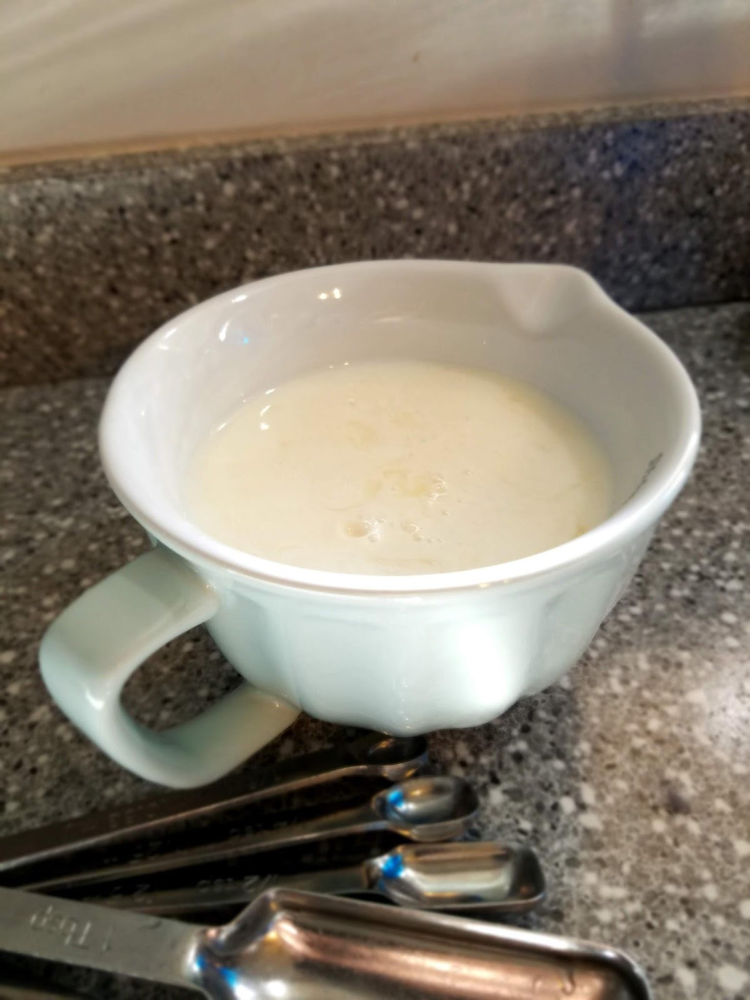
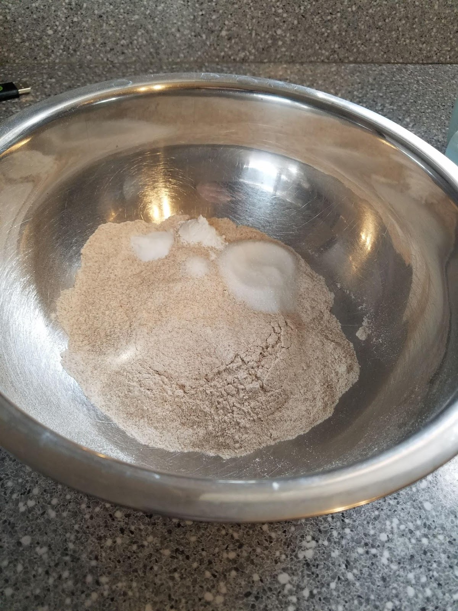
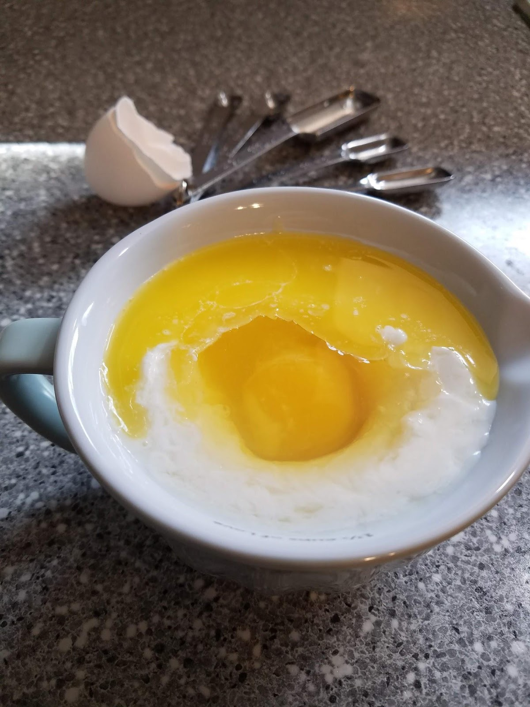
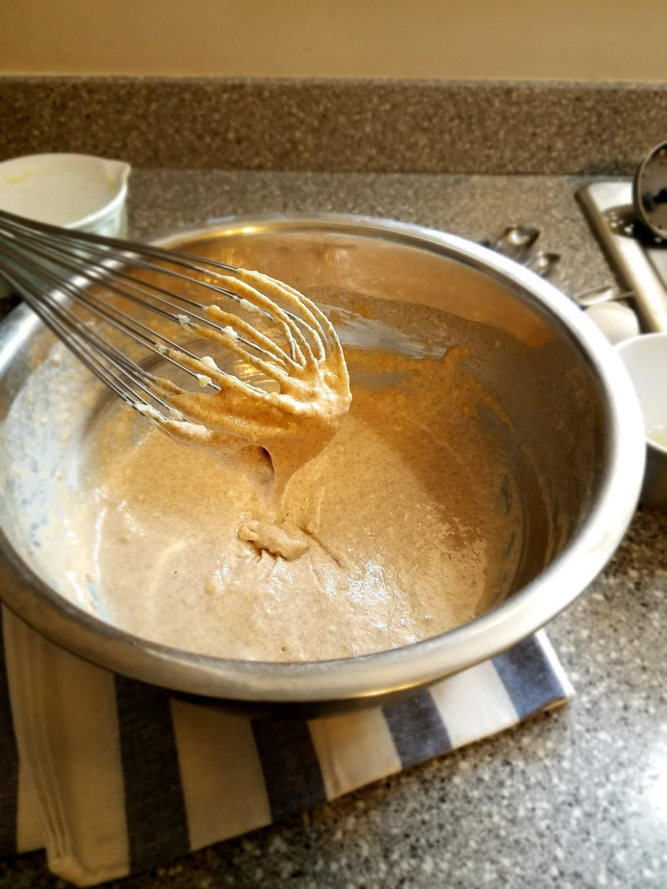
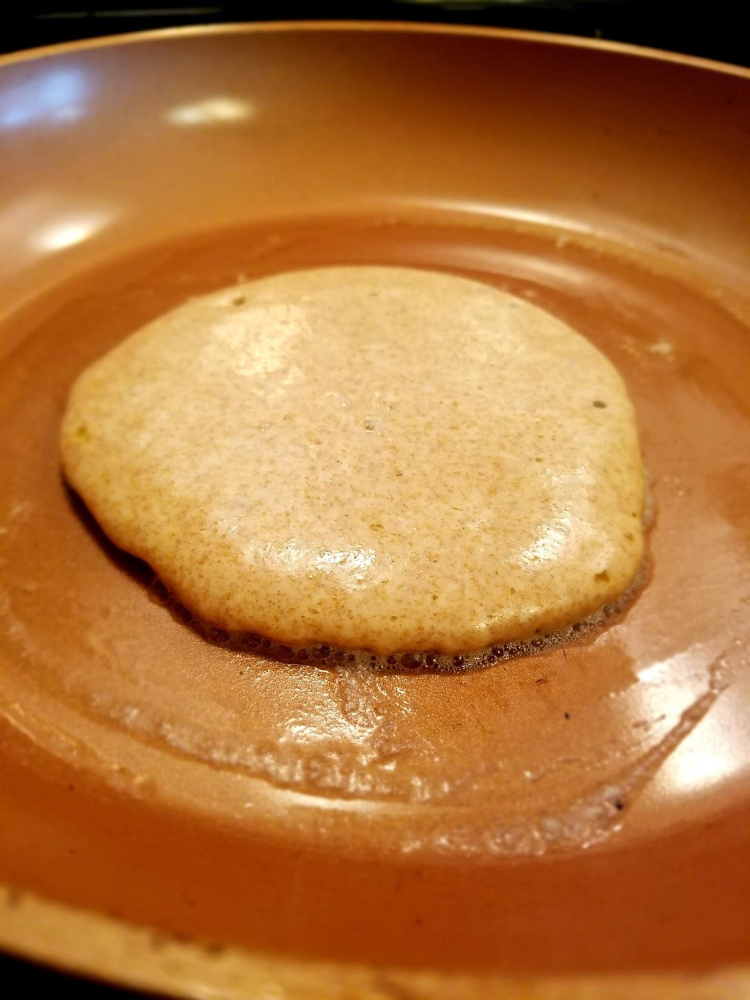
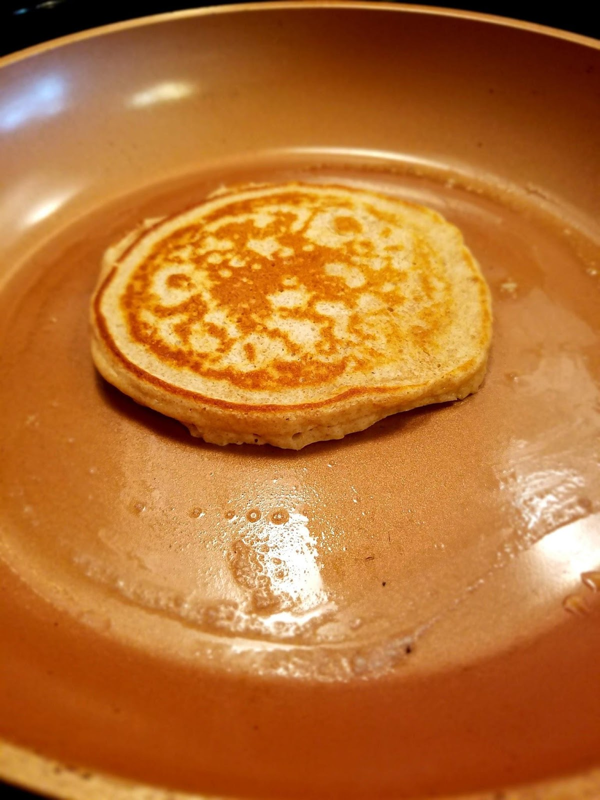
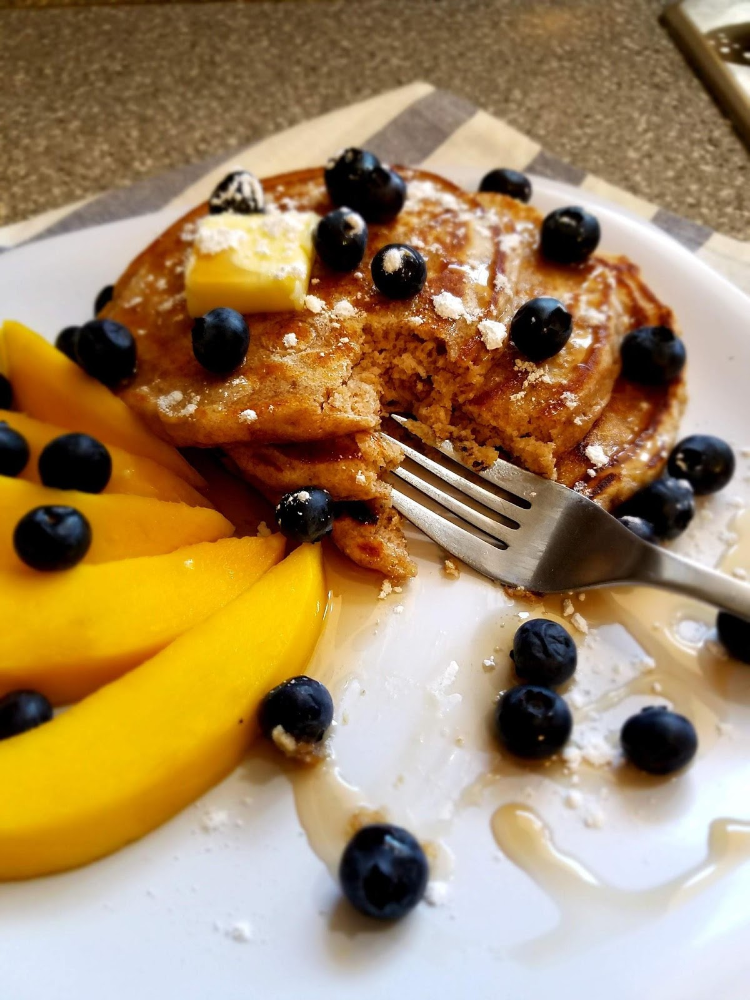

Mornings.

So controversial.

Are they really the glorious, productive, refreshing time that all the “Morning People” describe? Where motivation is at its strongest, creativity at its finest, intellect at its sharpest, physicality at its most energized? Is there really an abundance of hopefulness and optimism about the day ahead?

I think not.

Now before all you 5am morning joggers, green smoothie drinkers, hit the gym hard and get to work before 8am-ers come after me, just remember, there is space for us all in this world!

And I will gladly give you that time of day to do all your incredible and productive morning things!

You can have it all to yourself! As a token of my friendship and respect.

And I’ll admire you from my bed, where I will be sleeping as long as my two (and a half) children will possibly let me before they start throwing toys at my face and crushing graham crackers into the floor to get my attention.

Because I dread mornings. Truly.

My husband tried for years to get me to be up in the morning with him doing all those things. He claimed it was the secret to success and energy and mood benefits. He claimed it would change my life completely!

So I tried a few times, and you want to know the result?

A grumpy me at 7am, and then a really hungry grumpy me at 2pm, and then a monster me by 8pm sharp, completely out of juice for the day. And the next day was the same. And the next. I was a mess. I couldn’t get through the day without a nap, an abundance of sugar, and one or more good cries.

Fast forward to when I gave in and let myself sleep till 9am every day, and I wake up with a smile on my face, showering my kids with kisses, making a healthy breakfast for the whole family, throwing a load of laundry in the washer, getting the dishes done, exercising after lunch, running errands, being on-time places, and remaining calm and patient with my children (most of the time) until they are fast asleep, where I enjoy a few blissful hours alone with my husband and my hobbies before falling asleep myself a little after midnight.

It works for me. My husband decided it was “happy wife-happy life”. You do you, Boo Boo.

Breakfast, to me, lands somewhere between 9am and 11am, and usually consists of something delicious, filling, nutritious, and totally satisfying. It has to get me through the next several hours.

One breakfast I have found, that can consistently get me from 9:30am till 2:30am without needing much of anything in between apart from an occasional piece of fruit, is whole wheat pancakes.

My love of whole wheat pancakes began after my oldest daughter was born. I would spend mornings in my kitchen, her in her highchair watching me and throwing blueberries across the room with a bald little head and a mouthful of gums. I tried so many different recipes.

I didn’t want my whole wheat pancakes to be oat-y, grainy, or nutty. I didn’t want them to be flat or too egg-y, like that recipe that just uses bananas and eggs. I didn’t want them to be bland. I didn’t want to have to go buy a bunch of different flours or seeds. I just wanted Delicious, Fluffy, Filling and mostly Healthy Whole Wheat Pancakes.

Well, I figured it out. And now we eat these pancakes at least twice a week. They are quick, simple, and use ingredients from your pantry. No oats or flax seeds or protein powders or almond butters, although you can add any of those things to suit your preferences.

These are a perfect base for creativity.

Sometimes I put a little cinnamon in them, sometimes I add more sugar and sometimes less, sometimes I use lemon and blueberries or top them with strawberries and homemade whipped cream, and sometimes I just eat them with a whole lot of butter and a little of my favorite store bought syrup.

My dad would probably add peanut butter, bananas, and some kind of pecans or coconut flakes. My mother in law would add some vanilla and probably some chocolate chips. Most people would probably add some hazelnut spread. My sister would only use the purest organic maple syrup. My mom would make them as thin as she possibly could and then drown them in syrup. My husband will only it them (or anything) piping hot, off the pan no longer than 30 seconds.

Knock yourself out with all kinds of variations from toppings to batter-add-ins. These are Delicious.

In fact, as I made these this morning to photograph for this post, my 3 year old son quickly came to sit beside me at the table and together, we ate each and every bite of these and had a fight over who got the last piece! He won, of course, I can’t say no to his raspy little voice and giant brown eyes. And this was all after he had eaten his own pancake on his own plate with his fruit on the side, as had my daughter! These are their favorite. Am I still a little hungry because he ate most of my breakfast? Maybe. But I’m definitely not mad about it, and the memory of sharing those moments with my son licking syrup from our fingertips and selecting how many blueberries we wanted with each bite was totally worth it.

Try these! I hope you will enjoy them. If you don’t, then let me know how I can improve them in the comments below! We are ever-changing, ever-progressing beings, and our recipes have to be too.

Also, let me know how you and your family love to enjoy pancakes? What toppings do you use? Are you a pure maple syrup fan, or a sugar-filled fake syrup fan like me? Fruit or no fruit? Chocolate? Powdered sugar? Yogurt and granola? Tell me your favorites!

Now, for the pancakes.

You’ll want to start yourself off by adding the apple-cider vinegar to the milk. (The recipe that inspired this used buttermilk, and I’m sure that’s great too, but I never have buttermilk on hand! And I prefer the thinness of the regular milk to keep the batter consistency where I want it.) As you let the two ingredients sit for 5 or so minutes, the milk will curdle just slightly, and it will add that tanginess that made these stand out to me.

Milk + Apple Cider Vinegar

Next, using a medium-sized mixing bowl, you’ll combine the dry ingredients. The combination of both the baking soda and the baking powder really helps give these that signature fluffiness.

Dry Ingredients

After your milk and vinegar have curdled a little, you can add your melted butter to the milk mixture. The butter adds a great flavor to the pancakes as opposed to an oil or substitute.

After the butter has been added to the milk mixture and had a few seconds to cool off you can add the egg. Sometimes if I want more stability or I need a little extra protein I will add a second egg.

Wet Ingredients

Next, you’re going to add your wet ingredients to your dry ones and mix until combined.

Finished Batter

Then we cook! I used a nonstick frying pan on low-medium heat and added a small amount of butter to the pan before each pancake. This is optional but I think it gives it a great flavor and my frying pan has been known to be unreliably non-stick. I added about ⅓ cup of batter for each pancake.

Once you’ve gotten those little bubbles popping through the batter on the top, it’s time to flip!

Cook another minute or two on this side until golden brown and then your pancakes are done!

Enjoy!
