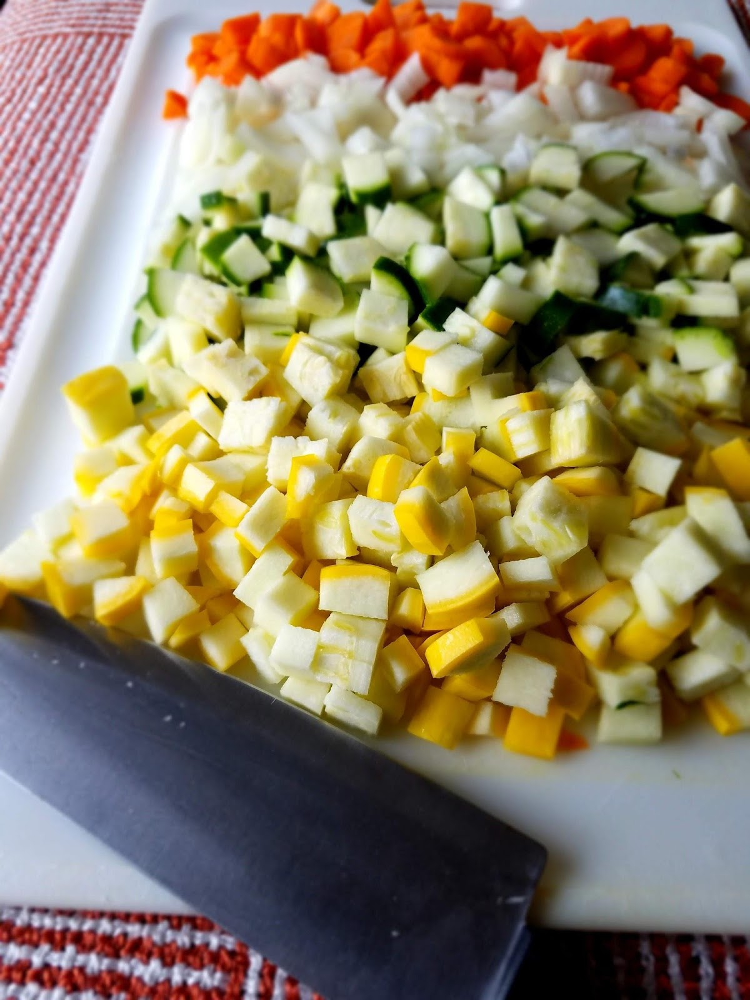
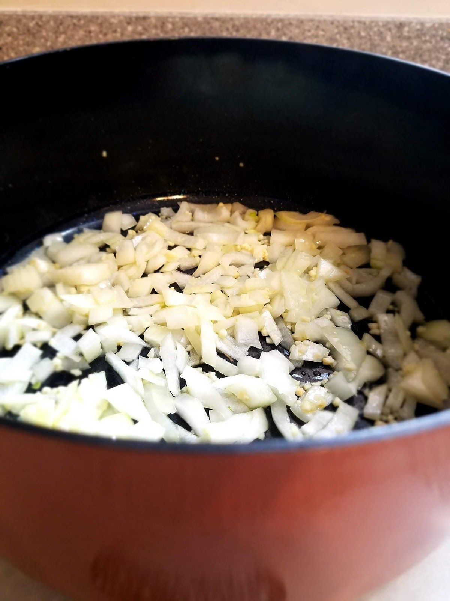
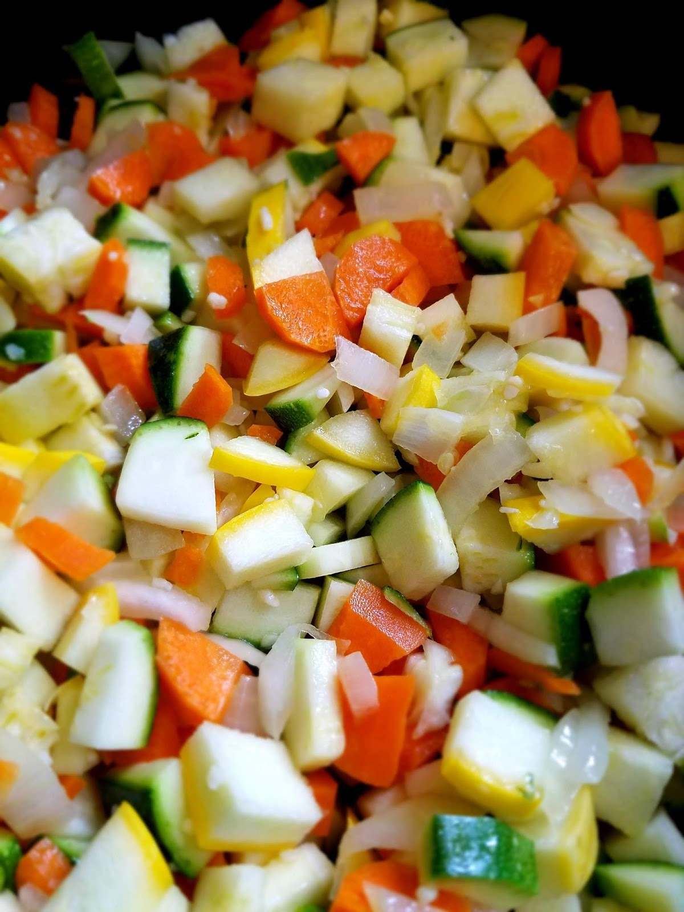
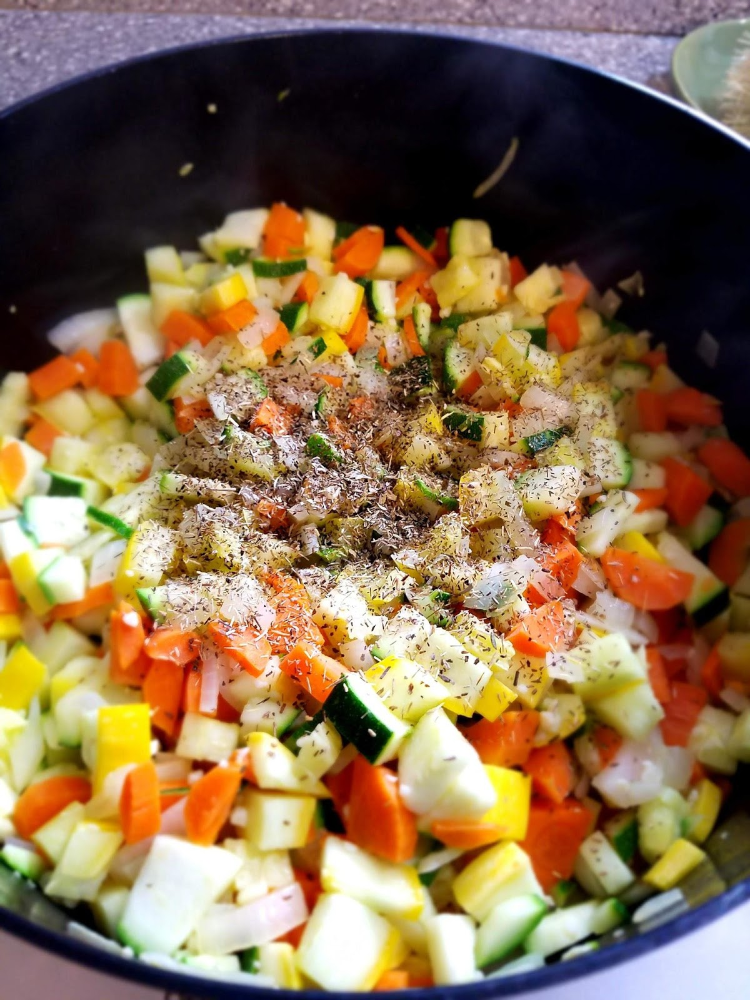
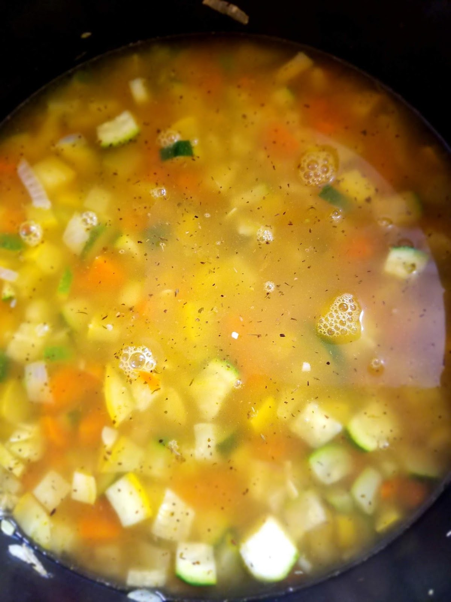
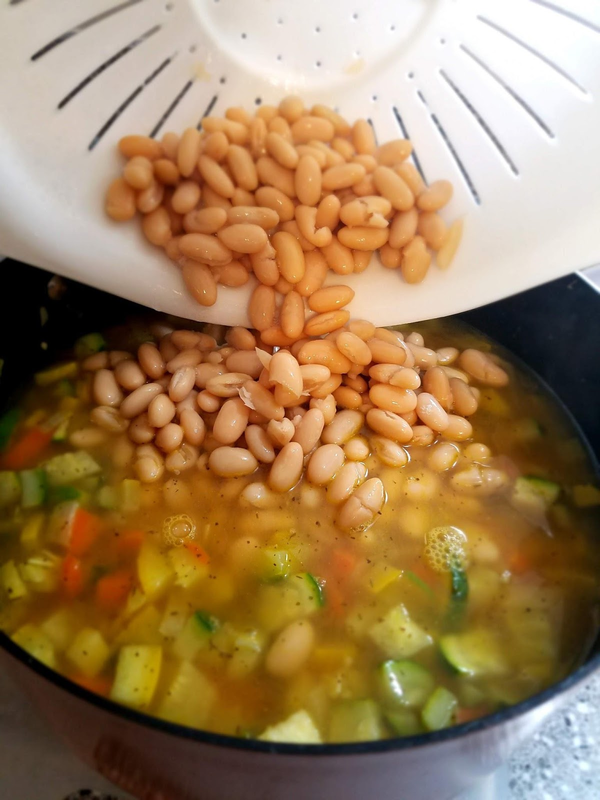
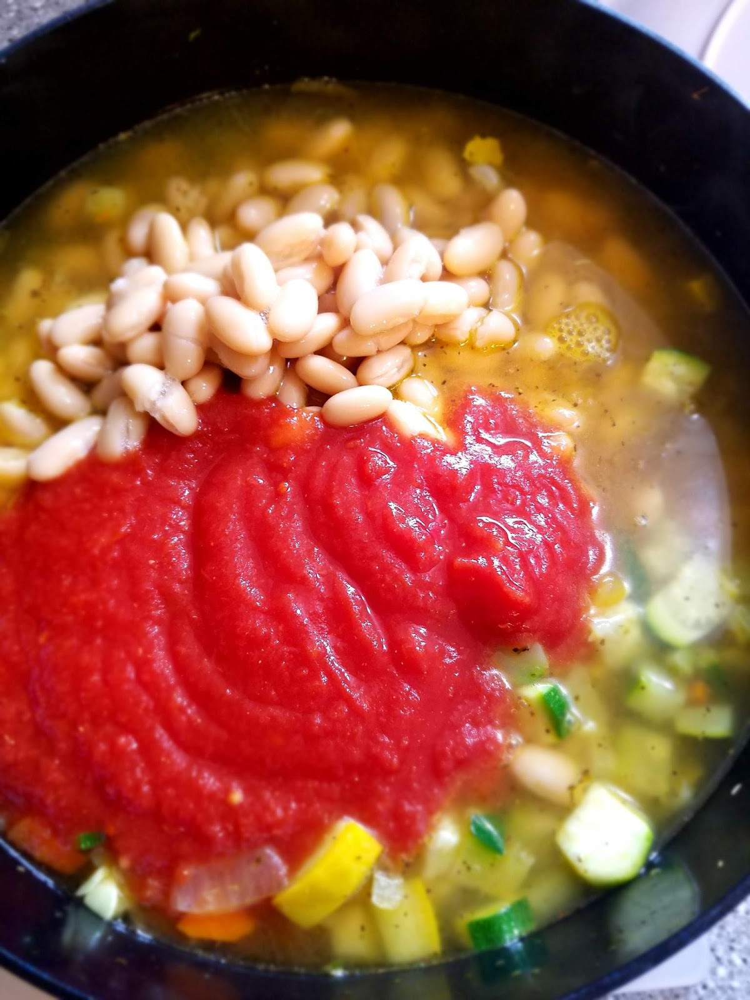
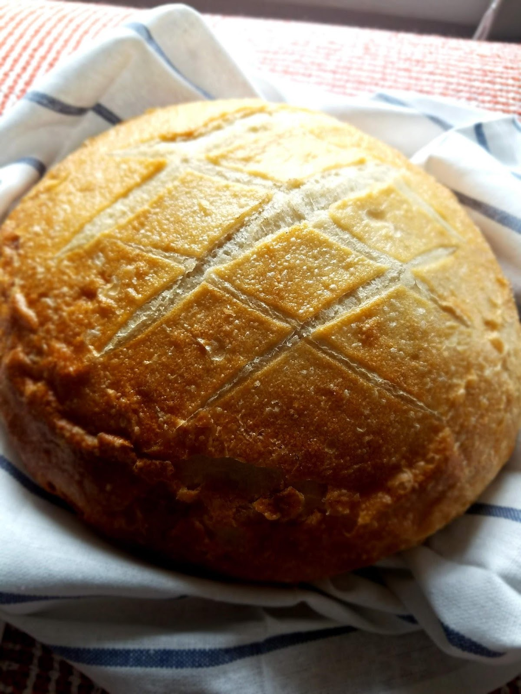
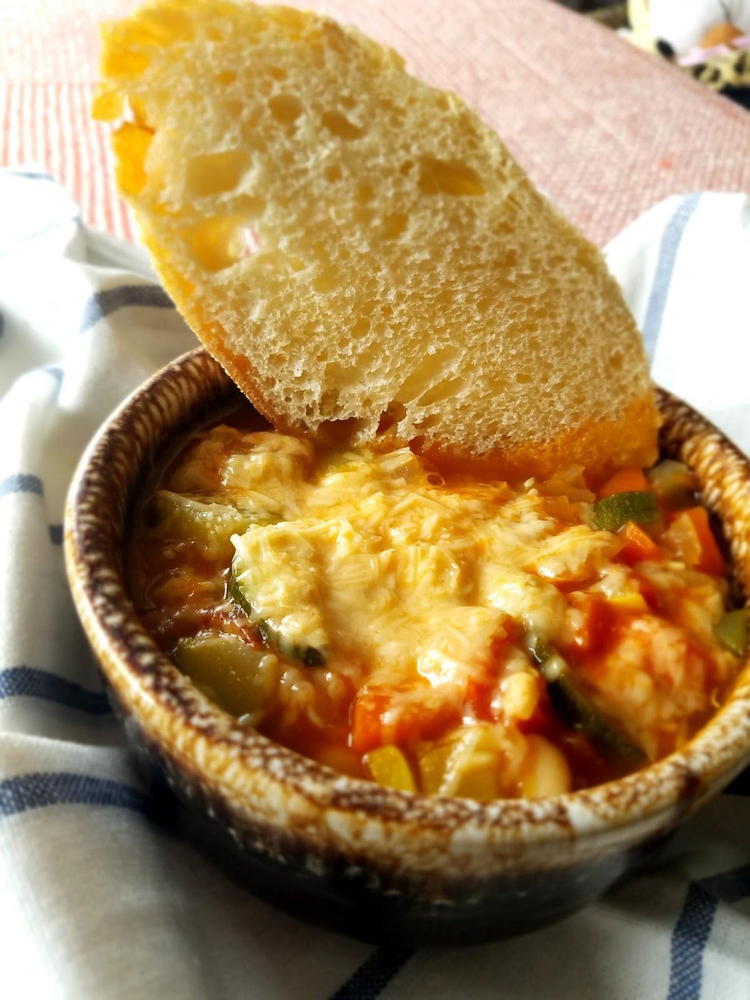
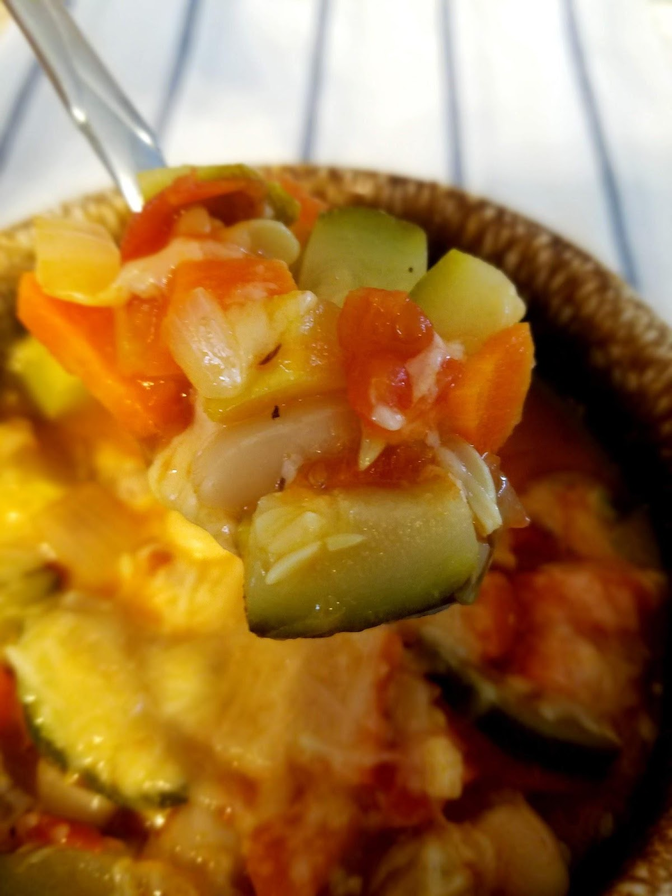

On my way home from picking up my daughter from preschool today, she requested a playdate with one of her little friends. So I texted her friend’s mom and asked if her daughter wanted to come over to our house to play. She responded, telling me that, although her daughter (who had attended the same preschool as my own daughter today) was not sick (yet), they’d had other friends over yesterday and those friends were home sick today.

Then, a few minutes later, my daughter tells me that yesterday a different friend from her class got sick on the playground and was absent from school today as well.

So I took a rain check on the playdate, and now I’m just counting down the hours until my daughter infects us all. When it comes to sickness and kids, it’s every man for himself! Am I right?

As a mom, I can handle sick kids. Just keep them in pajamas, turn on all their favorite shows, make a batch of soup to last through the next day, and enjoy the snuggles! I can even handle my husband getting sick. The care process is basically the same! Pajamas, TV or a good book, snuggles, and all the soup!

It’s really just all about the soup, you know?

Well this Tuscan Vegetable Soup is my favorite choice for sick days. My husband would argue that you can never replace a good chicken noodle soup, and I’ve made that a few times as well (recipe to come), but as for my kids and I, we prefer this one.

Not only is it vegetarian, it’s vegan! (until you add the Parmesan as an optional topping)

It uses four different vegetables and our favorite white beans, along with some delicious flavors including garlic, thyme, rosemary, vinegar, and of course, what we all crave when we’re sick, salt! I love that it’s in a vegetable broth rather than a chicken or beef broth, it provides a more neutral starting point for the flavors. Then top this soup off with some parmesan cheese and a crusty bread? Your sick body will be singing you praises.

Is this only for sick days? NO WAY! I make this soup at least once a month!

It helps me sneak extra veggies into my kids’ diet without a fight, it contributes to our goal for more delicious, easy meatless meals, and it makes enough for us to eat leftovers for lunch at least one day if not two. It’s healthy, light, cozy, and always a crowd pleaser.

I’ve sent this to sick friends’ houses, I’ve made it for baby showers where we did a soup bar, I’ve brought it to Fall and Winter Pot-Luck parties through church or friend gatherings, I’ve made it for a family girl’s trip (because no health conscious woman will pass up a great soup and salad lunch combo, right?). Everyone loves it, including me!

Try it out! You could add celery or kale to this if you want, to make it more nutrient dense. You could put freshly ground black pepper or crushed red pepper flakes in it to add a little kick. Customize your food for your tastes.

I start this soup by prepping the veggies. I peel the carrots and then dice them, along with the onion, zucchini and yellow squash.

Next I get a large soup pot and turn it on medium heat, I heat the olive oil and add the garlic and onion.

Cook until the onions are soft and the garlic is fragrant. Then I add in the rest of the vegetables.

I cook them down until all the vegetables are soft, including the carrots. Then I add in the thyme and rosemary.

Stir and cook until fragrant, then add the vegetable broth.

While that’s getting bubbly, drain and rinse your beans. Then add those in as well.

Next up is your can of crushed or diced tomatoes, juices and all. Mix everything together and simmer on low for about 10 minutes, uncovered.

While that’s simmering, you can get your crusty bread ready! We prefer a sour dough loaf. You use whatever your favorite kind of bread is for dipping.

Then top with parmesan cheese and serve with sliced bread!

Enjoy!
