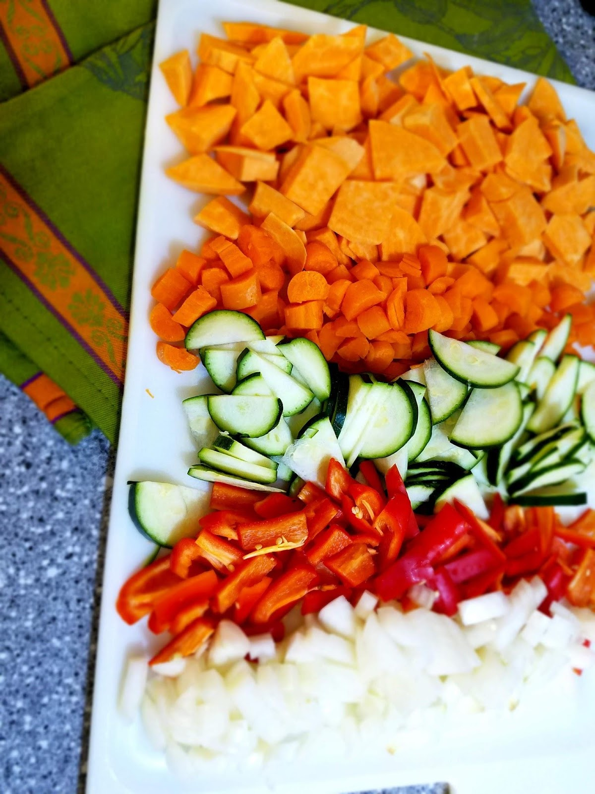

Thai food.

My husband and I discovered Thai food about six years ago. We were students at Utah State University. I was living in the campus dorms for my freshman year and my husband was living in an old apartment building down the street and we were totally in love.

He had a friend in one of his classes that was dating someone as well, and they invited us to go stay at her parent’s cabin out in Jackson, Wyoming for the weekend. We brought games and food and each got our own cozy cabin bedroom.

Saturday night we drove to the downtown shopping area and that’s where we had it for the first time, Thai food. We walked around with a freezing wind blowing, looking at the little shops and boutiques, admiring the giant antler arch, and we were ready for something to warm us up from the inside out.

We ordered a vegetable noodle dish to share and we were hooked.

It took me a few years to actually attempt my own Thai dish, though. I was so intimidated by all the flavors and spices, and I hadn’t cooked with coconut milk almost at all. Then one day a few years ago I stumbled upon a tiny glass jar in the Asian Foods section of my local grocery store that said, “Thai Red Curry Paste”. That was all I needed. Something to make it less intimidating.

So I started trying recipes that used the curry paste. There are green curry pastes and red curry pastes and I tried them both. I tried some that were soups, which were delicious. I tried some that were spicy, some that were nutty, and some that included fish or shrimp. The one I end up using most nights when I’m craving something cozy and yet light and soothing, is our favorite Vegetable Green Curry.

Keeping it vegetarian helps it feel light and makes the prep a lot easier, and it is still so filling and satisfying. I have added chicken, shrimp, salmon, and mild white fish to this recipe a few times and although it is still delicious, we prefer it without.

The sweet potatoes are our favorite part by far. They add the perfect sweetness that complements the coconut milk and the softness of their texture is so enjoyable. My kids will eat them up, along with the carrots and the zucchini that we add. My son skips around the red bell peppers but my daughter eats those first.

Overall this dish has always been a crowd-pleaser. My husband requests it a few times a month and since it makes more than the four of us can eat in one sitting, he is always eager to take the leftovers to work the next day. He’s told me several times how jealous his coworkers are when he warms this up and makes the office smell delicious.

We serve it with Brown Basmati Rice, which is light and filling and more nutritious than its white rice counterparts, but we’ve used all kinds of white and brown rices with it and nothing can take away from the deliciousness, so use the rice you prefer.

I always add red pepper flakes because if my food doesn’t have an element of spiciness I’m not satisfied, but the dish itself is very mild. I also suggest eating it with some fresh lime juice to add a little zest. It brings out the best of the flavors. My husband really enjoys adding fresh cilantro to the top of his.

Try it out. Add what you like. Don’t like bell peppers? Add mushrooms instead. Or add yellow squash or even broccoli. Make it how you want it! Then let me know what your favorite version of this is in the comments below! I’d love to discover new ways to serve this dish.

First, Get your rice cooking. We put ours in a rice cooker and let it do it’s thing, but if you’re doing stove top or microwave or whatever, get it going so it’ll all be ready at the same time. Our Brown basmati rice took almost an hour to cook in our rice cooker so we started it ahead of time. The recipe itself takes about 45 minutes, prep and cooking time included.

Then you’ll want get chopping. Prepare all your vegetables beforehand so they are ready to go. We added sweet potato, carrots, zucchini, red bell pepper, and onions. Sometimes we add mushroom and yellow squash as well, but these are the veggies I chose that night.

We begin the cooking process by adding some olive oil to a large nonstick frying pan. Then toss in your onions, garlic, and ginger. Cook till onions are soft and garlic and ginger are fragrant.

Then add the rest of the vegetables. Cover and cook on medium-low heat until the carrots and sweet potato are soft. It takes several minutes at least, so prepare to wait on these.

After the vegetables are tender, add in your Green curry paste. I found mine at our local Kroger.

Mix and cook for a few minutes, until fragrant. Then add in your Coconut milk. I suggest using full fat for the best flavor. We’ve tried “lite” coconut milks in this and it really detracts from the richness of the curry. Next you’ll add the water. Let it simmer on medium-low heat for three to five minutes.

Last, you’ll add in the sugar, lime juice, soy sauce and salt. Then serve it up and enjoy!
