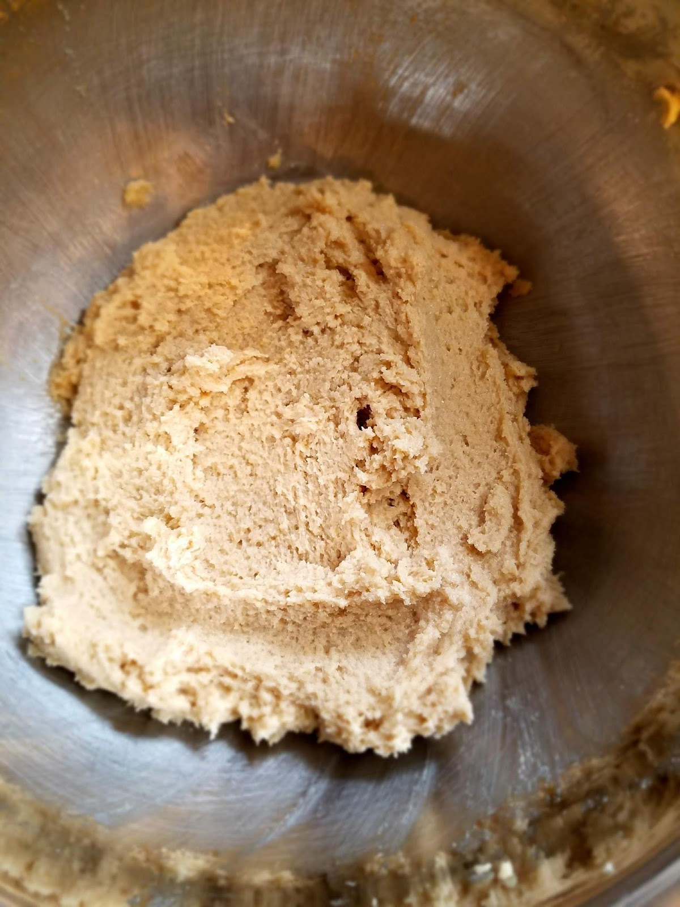

I know. It’s quite a claim. Trust me, these are the best. Truly.

Chocolate chip cookies are so heavily analyzed and debated in any setting involving people who bake (and people who eat).

Everyone has different qualifications for what makes a good chocolate chip cookie, and everyone has a different method. There’s so many different ingredients people have added in to try and make them better or fancier. I’ve tried a lot of them!

Some people use oat flour for a richer dough flavor. Tried it.

Some people use milk chocolate chips for a sweeter cookie. Tried it.

Some people use only dark brown sugar. Tried it.

Some people use only white granulated sugar. Tried it.

Some people use extra flour for a denser cookie. Tried it.

Some people use shortening instead of butter. Tried it.

Some people only believe in using 80% cacao nibs, chopped irregularly for texture and bitterness. Tried it.

Some people brown their butter before they use it. Tried it.

Some people use a plethora of other kinds of flour in order to make these “healthier” or fit a specific dietary need. I’ve tried some of those too. (if you have allergies or a food intolerance, you do you boo boo. No judgement here.)

But am I out to make the perfect Gluten Free or Paleo cookie? No sir! I am not!

I’m out to make the best regular, good old fashioned, seen it in every mom’s recipe book, basic, delicious, classic, can’t stop eating the dough or the cookies CHOCOLATE CHIP COOKIE!

And I think I may have cracked it. And as for the ingredients, it’s so much simpler than all that extra stuff up there.

Chocolate chip cookies are sensitive, though. Certain things have to be perfect in order to make them extraordinary rather than plain and basic. It doesn’t take any fancy ingredients, just a little time and a little attention to detail and BAM! SHAZAM! KAPOW! You’ve got yourself some neighborhood famous cookies.

Some of my tips and tricks (all tried and true):

Softened and slightly melt-y butter works best for me.

Half white and half dark brown sugar is perfect. (make sure you pack that brown sugar into the measuring cup. Don’t skimp.)

Cream your butter and sugar for at least 3-5 minutes until it’s sort of whipped/fluffy.

Use regular, basic white flour, but do not add too much! Use less than you think you should and it will be perfect.

Add a little extra salt. Magic happens when you balance your salt with your sugars and fats. If one of them is overdone, the whole thing is off balance and it’s totally noticeable. Nobody wants cookies that are too sweet or too salty.

Semi-sweet chocolate chips are the only way to go. Milk chocolate is too sweet and messes with your balance (as explained above), and dark chocolate can be good to some people (I know some people are die-hard dark chocolate lovers, and I enjoy it on occasion myself), but is often too bitter for your average cookie-eater. Semi-sweet is the sweet spot. You can use a high quality bar of chocolate and chop it for a varied texture, but the chips are much easier and it really doesn’t add enough to make it worth it. Plus that can be more expensive and a lot more time consuming.

Mix with an electric hand mixer, or a fork. Don’t use a wooden spoon, it never does the trick.

This part is rough, but you have to chill the dough for best baking results! If you don’t, your cookie will spread too much and it won’t have that magical, famous chewy golden edges/top with the perfect soft, almost doughy middle. It’ll cook too evenly! And we don’t want that. We want contrast people!

Next, once your dough has cooled for at least two hours, go through the laborious task of scooping it out with a cookie scooper. The cookie scooper makes a taller dough ball than you usually would with your hands, and it also makes the shape of the dough perfect for the said crispy/gooey-ness to happen. If you don’t have one, then on top of each medium-sized round ball of dough, add a smaller round ball of dough directly on top, making it look like a headless snowman. I can’t explain it, but it makes it so much better! The cookie will be thicker and chewier.

Then you’ll bake them. 350F is perfect. There’s no perfect time, it’s somewhere between 8-11 minutes. You just have to watch them and wait for the edges and small bits of the center to get golden. It depends on how big your cookies are, how cold the dough was, and how hot your oven cooks. Then pull them out. Don’t wait too long. The chewiness comes from the slightly underdone center, it’s absolutely necessary.

That’s it. That’s all I’ve got. But it works! I’ve had so many people tell me that my chocolate chip cookies are some of the best they’ve had, and they all ask me for the recipe and the secret.

My husband asks me to make these for him almost every Sunday, and also when we have guests over he asks me to make them again. (I think he thinks it will impress them, but I just make them because they are straight up delish.)

Check them out! Follow the added steps up above and I hope they turn out so good!

This recipe was originally from The Food Nanny’s recipe book called “The Food Nanny Rescues Dinner”, and I’ve worked with it for years to doctor the process exactly.

(Also, the dough is irresistible, if you’re a dough eater. If you think dough is abominable and disgusting then, fine, be that way. More for the rest of us. Will we get salmonella? Probably not, but maybe! Is it worth it? I’d like to think so.)

Start with creaming your butter and sugars.

Next add your eggs and vanilla.

Then add in your dry ingredients.

Mix till well combined.

Next comes the chocolate chippers!

And Voila, you’ve got yourself a delicious dough.

Now try not to eat all of it, and chill it in the fridge for at least two hours before scooping.

Next, bake to perfection!

