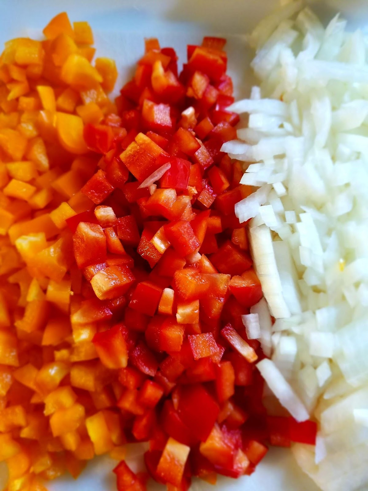
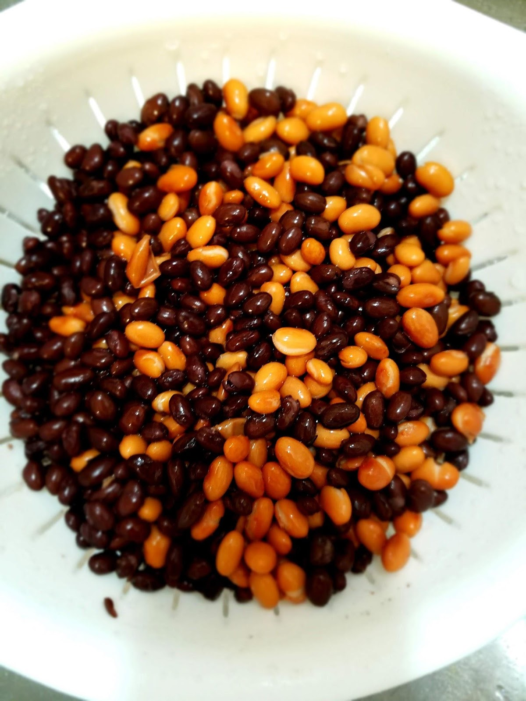
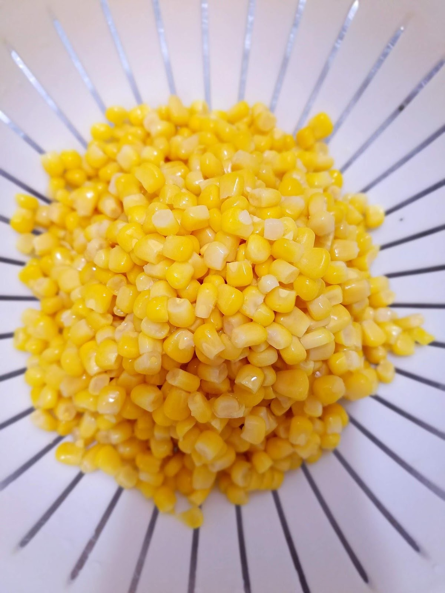
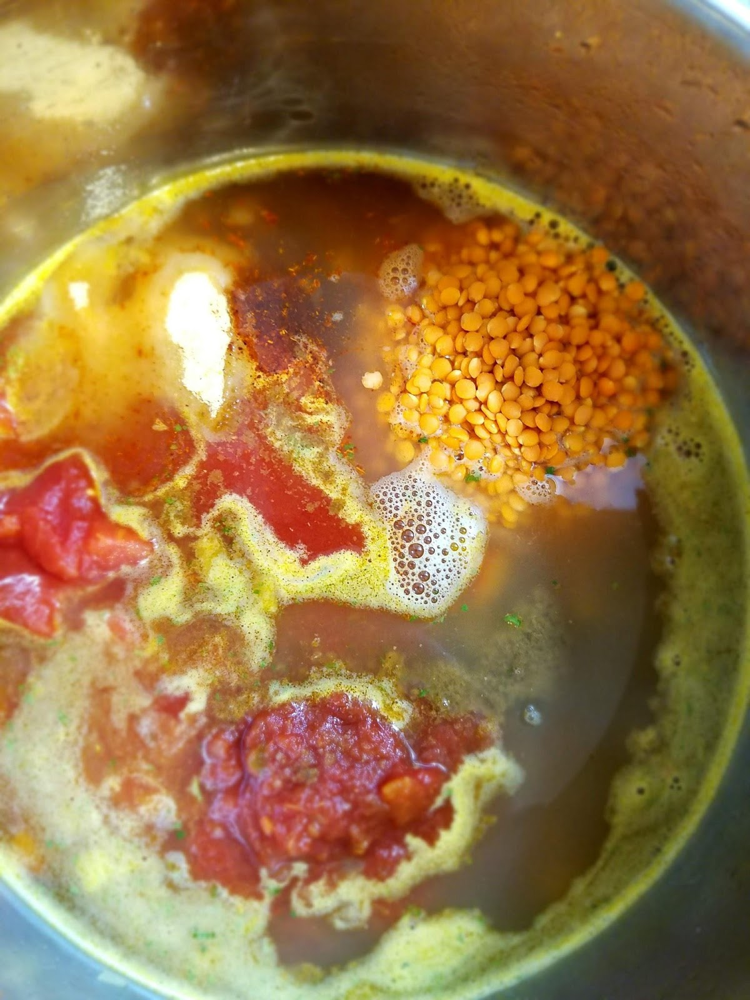
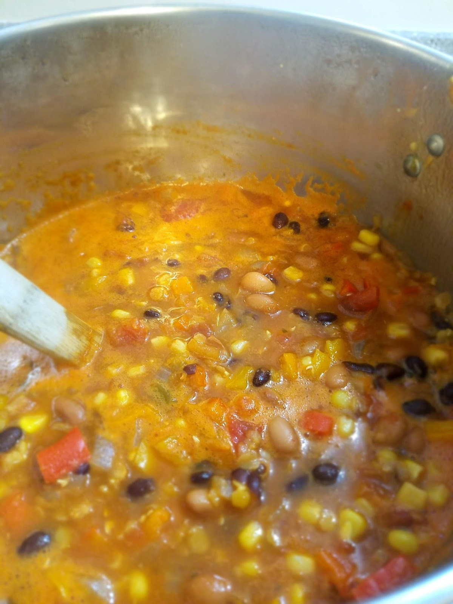
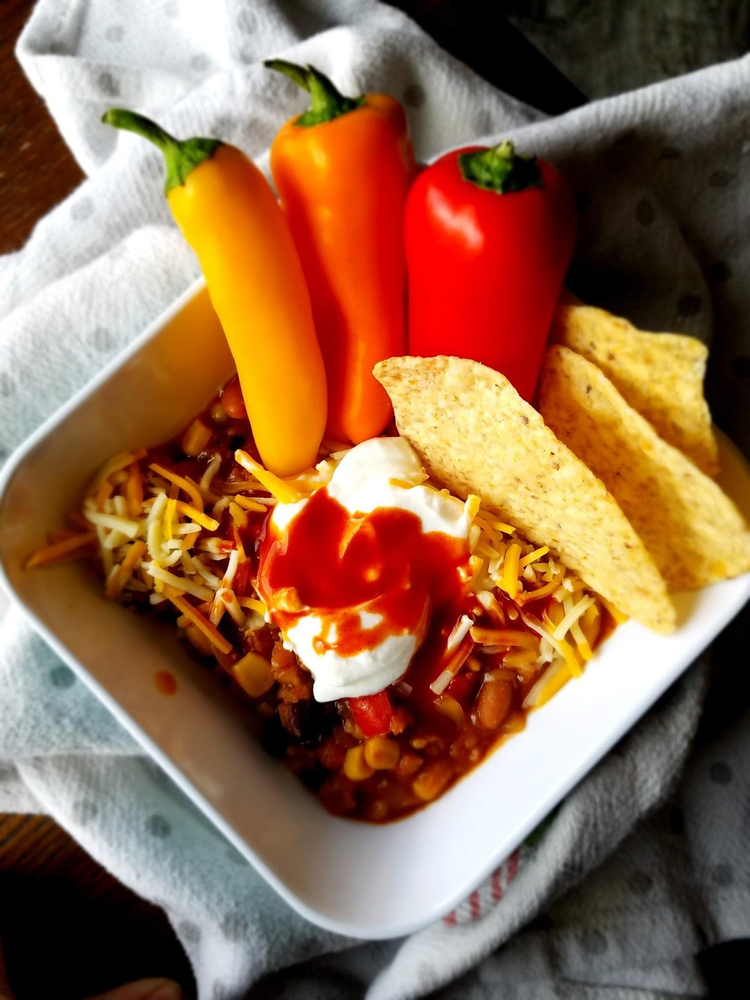
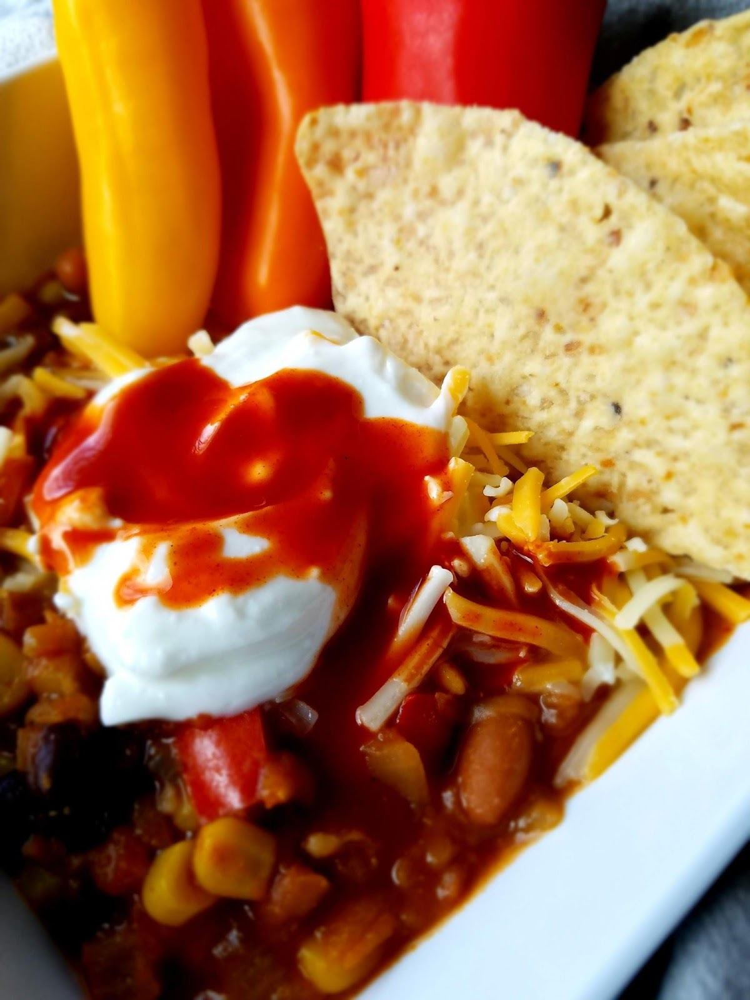

Lentil Tortilla Soup

This is another vegetarian meal.

A vegetarian diet is really controversial. I know some people don’t eat meat (or any animal products) for humanitarian reasons, or for environmental reasons. Some abstain from it because of religious reasons. Some don’t eat it because they genuinely don’t like it (more rare, but still happens). Many people, though, aim for a more plant-based diet for health reasons.

There are so many arguments for a plant-based or vegetarian diet, and so many of them are totally valid.

On the other hand, there are a lot of people who believe in consuming meat and animal products, and who can’t imagine their lives without those things!

Who am I to judge what is the best diet for someone else’s health, lifestyle, and wellbeing?

I do, however, believe that there is a lot to be gained from at least cutting down on the animal products we consume. So that’s where I like to put my focus, on CUTTING BACK, rather than CUTTING OUT.

It’s much more practical for us, ends up saving us some money, and also helps my kids understand the idea that not every meal has to be focused on meat! They eat our vegetarian meals just as heartily as they do our meat meals, if not more so! It also has influenced how they feel about vegetables in general. They see them as an essential and delicious part of a meal because sometimes that’s what is taking up most of their plate or bowl! I have loved that side effect.

As of now, we eat an average of 3 meatless meals a week, and 4 meat meals. This is our Dinner average. I also try to maintain that balance for myself and my kids for our Lunch meals as well. We almost never have any meat for breakfast, so overall we end up cutting out about a third of our overall meat consumption each week. This is what I feel comfortable with. I am hoping in the future I can decrease our meat intake slightly more, but I don’t feel a need to cut it out completely at this time in my life. Maybe that will change someday, but today I’m feeling pretty good about our balance.

When we first started eating less meat it was after I’d had my oldest daughter. I got really into health and nutrition (which was my major in college until I decided trying to finish a difficult, demanding, inflexible dietetics degree with a baby, a toddler and a husband still in school full time and working full time was just way too much) and I researched the benefits of cutting back on animal products. What I found was really convincing and I was determined to eat less meat.

Being the nerd that I am, I went on a testing spree of so many different vegetarian recipes and ended up with a lot that we absolutely love. We ate a lot of Japanese, Thai, Mexican and Italian food. Things like vegetable curries, tofu stir fry’s, bean and rice burritos, vegetable pastas, etc. We incorporated a lot of quinoa, brown rice, protein noodles, oats, lentils and beans to compensate.

Then the winter came and I dipped my toes into the incredible world of soups. There are so many delicious, flavorful, filling, nutritious and protein packed vegetarian soups!

I tested out at least two a week for three months and ended up with a handful of our very favorites that make it onto the list of our top meals (meat meals included).

This particular soup is one of those.

It’s the equivalent of a taco/tortilla soup but with way more nutrition and way less fat and sodium! It is so packed with protein and fiber I am full for several hours after a bowl of this stuff, and it tastes so good that I crave it at least once a month. It makes plenty, which means my husband will have leftovers to take to work (which saves us money) and can also be used to feed a crowd easily! Or you can double it and put half of it in the freezer for an easy, delicious freezer meal on a stressful day. That’s what I did!

It uses onions and red peppers as your fresh ingredients and then two kinds of beans, corn, canned tomatoes, vegetable broth, and red lentils coming from the pantry. The blend of spices added makes it so flavorful!

We eat this with chips and topped with sour cream (or plain Greek yogurt for a healthier option).

I will warn you, the fiber content of this soup is off the charts so if you’re someone who does not need extra fiber in your diet then be prepared for those effects! If you’re someone who’s always looking for more fiber to keep your gut happy and healthy (like me) then this is your new favorite soup. You can take our word for it.

Start with chopping your onion and bell peppers.

Then toss them into the pot with the olive oil until the onions are translucent and the peppers are slightly soft. Next, rinse your beans and corn

Add those to your pot and then pour the vegetable broth and the crushed or diced tomatoes over the top. Then you’ll toss in your salsa, lentils, and seasonings and bring to a simmer.

Simmer on Medium-Low heat for 15-20 minutes, until lentils have expanded and softened.

Then serve with chips, sour cream, some shredded cheese and a little hot sauce or lime!

